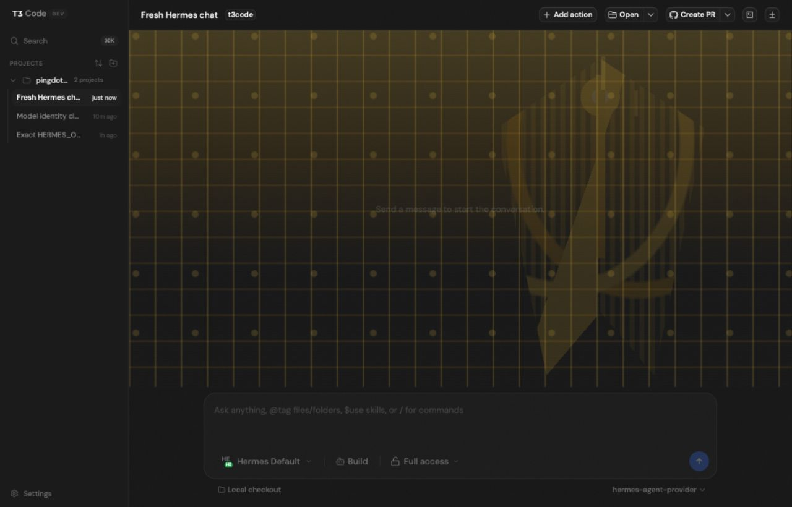
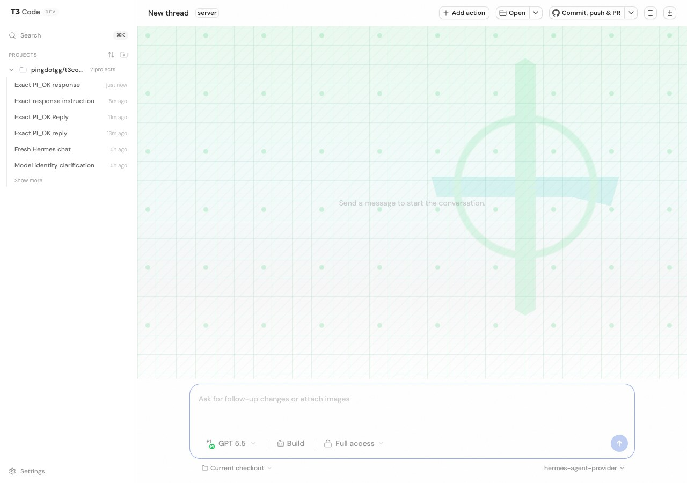

# T3 Code

T3 Code is a minimal web GUI for coding agents (currently Codex, Claude, OpenCode, Hermes, and Pi, more coming soon).

## Installation

> [!WARNING]
> T3 Code currently supports Codex, Claude, OpenCode, Hermes, and Pi.
> Install and authenticate at least one provider before use:
>
> - Codex: install [Codex CLI](https://developers.openai.com/codex/cli) and run `codex login`
> - Claude: install [Claude Code](https://claude.com/product/claude-code) and run `claude auth login`
> - OpenCode: install [OpenCode](https://opencode.ai) and run `opencode auth login`
> - Hermes: install [Hermes Agent](https://github.com/nousresearch/hermes-agent) and run `hermes model`
> - Pi: install [Pi Agent](https://github.com/earendil-works/pi) plus `pi-acp`, then run `pi`

Hermes setup notes: [docs/providers/hermes.md](./docs/providers/hermes.md)
Pi setup notes: [docs/providers/pi.md](./docs/providers/pi.md)
Release readiness checklist: [docs/providers/release-readiness.md](./docs/providers/release-readiness.md)

## Hermes Agent support

T3 Code can run [Hermes Agent](https://github.com/nousresearch/hermes-agent) as a local ACP
provider. Enable Hermes from **Settings -> Providers**, point the binary path at your local
`hermes` executable, then select Hermes from the chat model picker.



Recommended macOS setup:

```bash
git clone https://github.com/nousresearch/hermes-agent.git ~/Projects/hermes-agent
cd ~/Projects/hermes-agent
python3 -m venv venv
./venv/bin/pip install -e .
mkdir -p ~/.local/bin
ln -sf ~/Projects/hermes-agent/venv/bin/hermes ~/.local/bin/hermes
~/.local/bin/hermes model
```

T3 Code auto-detects common Hermes paths such as `~/.local/bin/hermes`,
`~/Projects/hermes-agent/venv/bin/hermes`, `/opt/homebrew/bin/hermes`, and `/usr/local/bin/hermes`.
On Windows, use a full path such as `C:\Users\you\Projects\hermes-agent\venv\Scripts\hermes.exe`.
Hermes manages authentication through its own CLI and local config; T3 Code starts `hermes acp`
only when a Hermes conversation needs it.

Full setup and troubleshooting guide: [docs/providers/hermes.md](./docs/providers/hermes.md)

## Pi Agent support

T3 Code can run [Pi Agent](https://github.com/earendil-works/pi) through the
[`pi-acp`](https://github.com/svkozak/pi-acp) adapter. Enable Pi from
**Settings -> Providers**, set the ACP adapter path to `pi-acp`, set the Pi binary path to `pi` or
an absolute path, then select Pi from the chat model picker.



```bash
npm install -g @earendil-works/pi-coding-agent pi-acp
pi --version
pi-acp --help
```

T3 Code passes the configured Pi binary to the adapter with `PI_ACP_PI_COMMAND`, which keeps the
packaged desktop app working even when npm's global binary directory is not on the GUI app `PATH`.
On Windows, npm shims usually live under `C:\Users\you\AppData\Roaming\npm\pi-acp.cmd` and
`C:\Users\you\AppData\Roaming\npm\pi.cmd`.
Provider Settings also exposes a Pi update action, so users can run `pi update` from the same
place they configure the provider.

For GPT-5.5, run `pi`, use `/login`, choose ChatGPT Plus/Pro Codex, and set Pi's defaults to
`openai-codex` with `gpt-5.5`.

Full setup and troubleshooting guide: [docs/providers/pi.md](./docs/providers/pi.md)

### Run without installing

```bash
npx t3
```

### Desktop app

Install the latest version of the desktop app from [GitHub Releases](https://github.com/pingdotgg/t3code/releases), or from your favorite package registry:

#### Windows (`winget`)

```bash
winget install T3Tools.T3Code
```

#### macOS (Homebrew)

```bash
brew install --cask t3-code
```

#### Arch Linux (AUR)

```bash
yay -S t3code-bin
```

## Some notes

We are very very early in this project. Expect bugs.

We are not accepting contributions yet.

Observability guide: [docs/observability.md](./docs/observability.md)

## If you REALLY want to contribute still.... read this first

Before local development, prepare the environment and install dependencies:

```bash
# Optional: only needed if you use mise for dev tool management.
mise install
bun install .
```

Read [CONTRIBUTING.md](./CONTRIBUTING.md) before opening an issue or PR.

Need support? Join the [Discord](https://discord.gg/jn4EGJjrvv).
