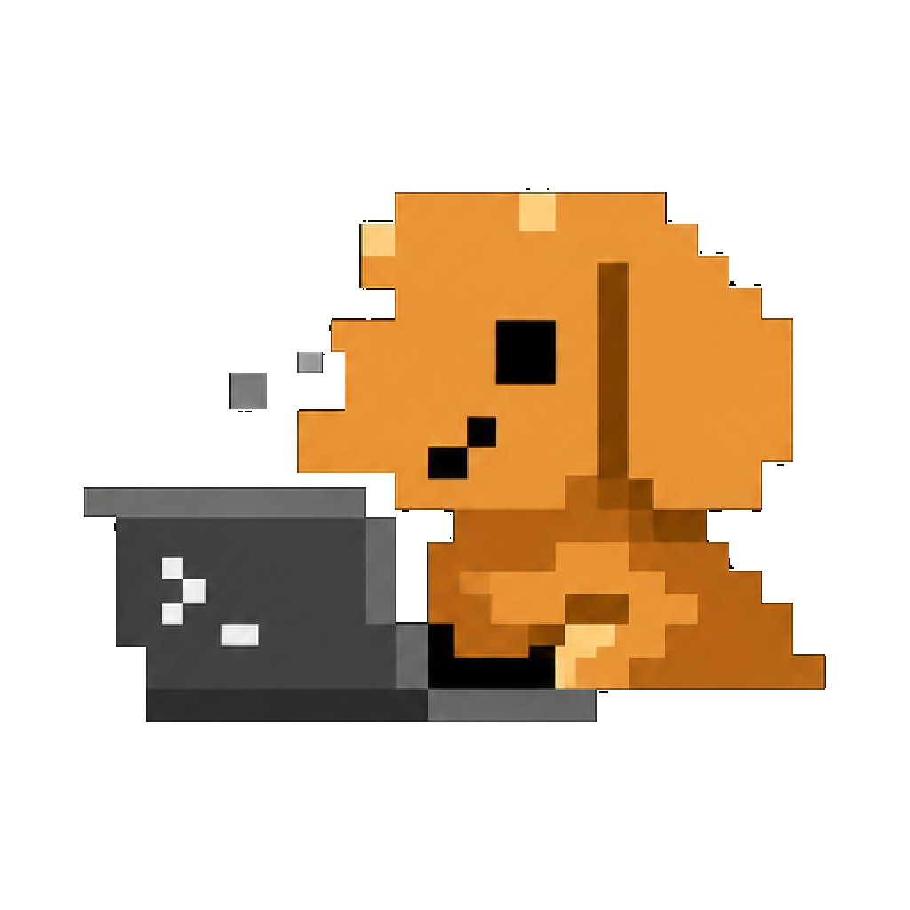

<p align="center">
  
</p>

# Salchi

Salchi is a minimal web GUI for coding agents (currently Codex, Claude, and OpenCode, more coming soon).

## Installation

> [!WARNING]
> Salchi currently supports Codex, Claude, and OpenCode.
> Install and authenticate at least one provider before use:
>
> - Codex: install [Codex CLI](https://developers.openai.com/codex/cli) and run `codex login`
> - Claude: install [Claude Code](https://claude.com/product/claude-code) and run `claude auth login`
> - OpenCode: install [OpenCode](https://opencode.ai) and run `opencode auth login`

### Run without installing

```bash
npx salchi
```

### Run over Tailscale on macOS

To expose a headless Salchi server to devices on your Tailnet and keep macOS awake while it is running:

```bash
tailscale status

caffeinate -ims npx salchi serve --tailscale-serve --port 4888 /path/to/project
```

Salchi prints a pairing URL like:

```text
https://your-mac.your-tailnet.ts.net/pair#token=...
```

Open that URL from another device signed into the same Tailnet.

Use a non-default Tailscale HTTPS port with:

```bash
caffeinate -ims npx salchi serve \
  --tailscale-serve \
  --tailscale-serve-port 8443 \
  --port 4888 \
  /path/to/project
```

Stop the Tailscale Serve route afterward with:

```bash
tailscale serve --https=443 off
```

`caffeinate` keeps macOS awake while Salchi is running, but it will not reliably keep a Mac awake with the lid closed. Keep the lid open, or use clamshell mode with power connected and an external display, keyboard, and mouse.

### Desktop app

Install the latest version of the desktop app from [GitHub Releases](https://github.com/JoseRFelix/salchi/releases).

## Some notes

We are very very early in this project. Expect bugs.

We are not accepting contributions yet.

Observability guide: [docs/observability.md](./docs/observability.md)

## If you REALLY want to contribute still.... read this first

Before local development, prepare the environment and install dependencies:

```bash
# Optional: only needed if you use mise for dev tool management.
mise install
bun install .
```

Read [CONTRIBUTING.md](./CONTRIBUTING.md) before opening an issue or PR.

Need support? Join the [Discord](https://discord.gg/jn4EGJjrvv).
