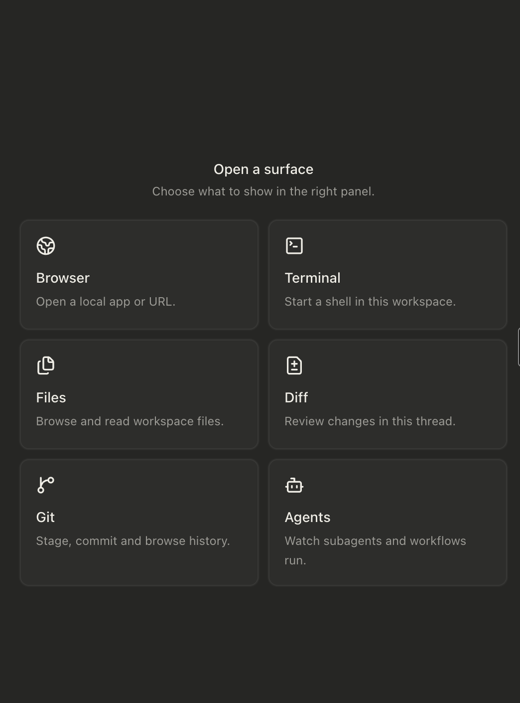
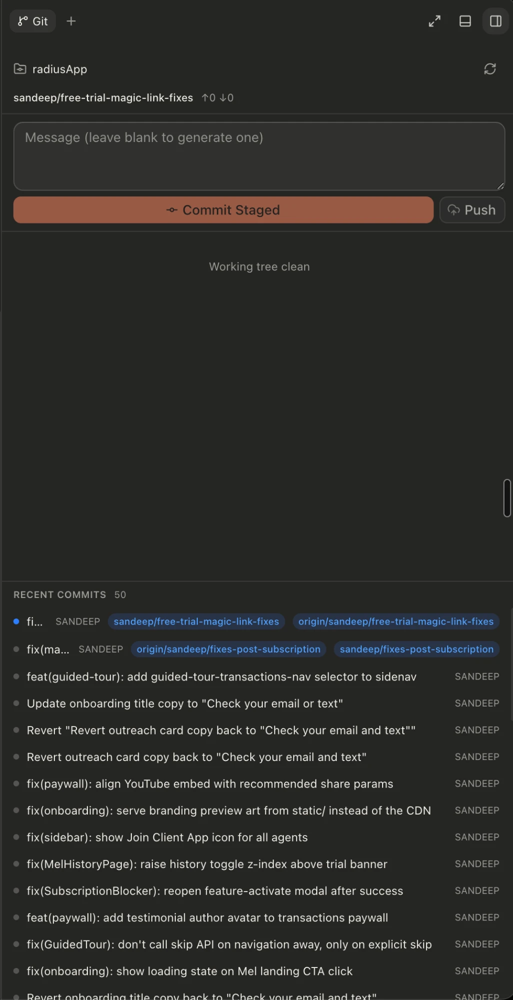
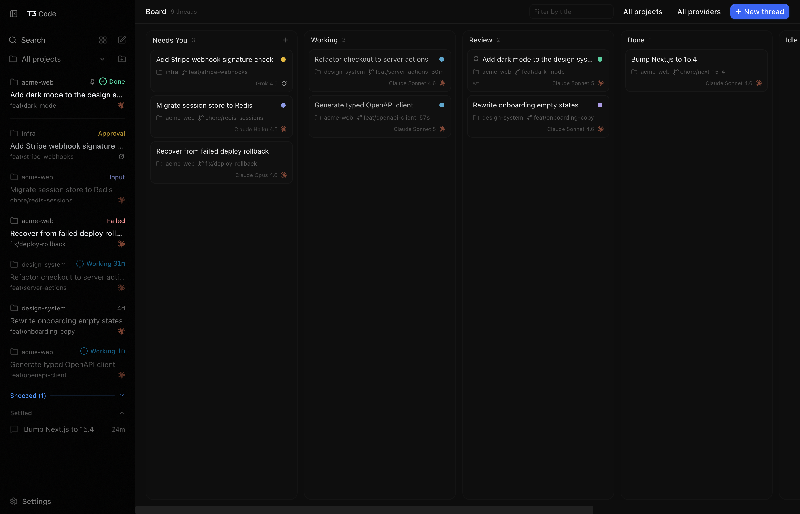
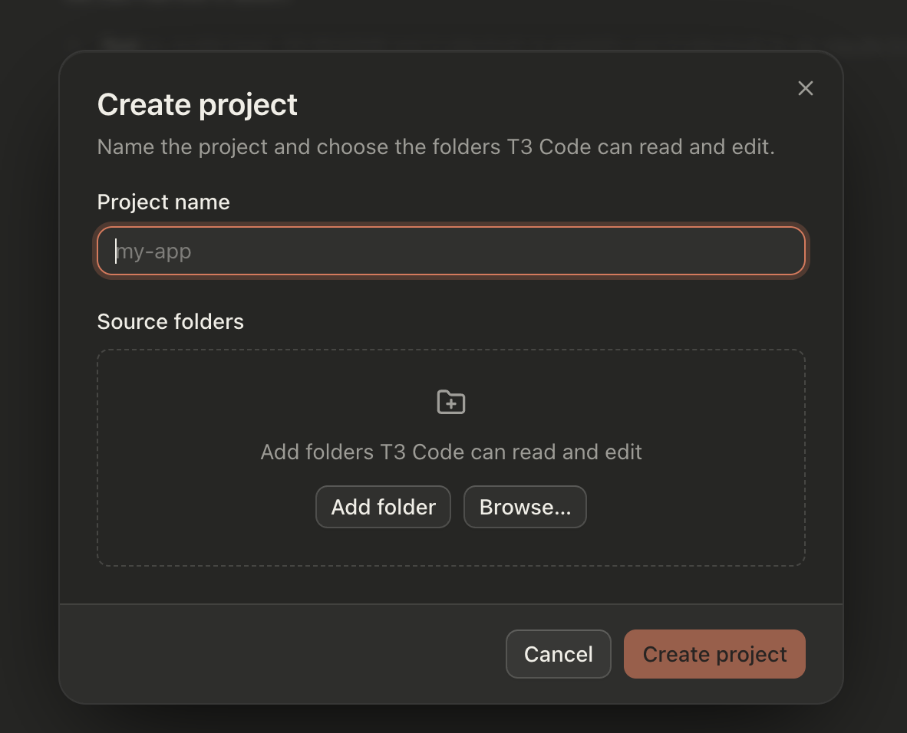
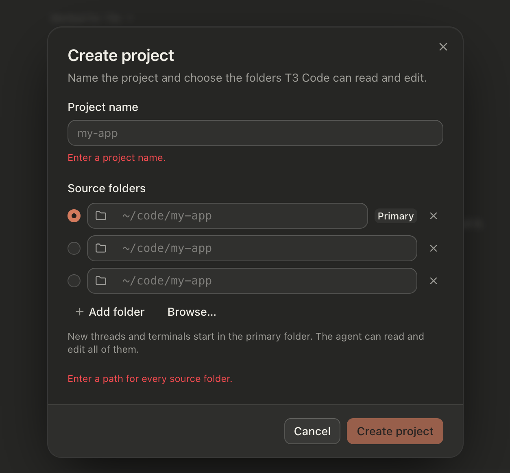
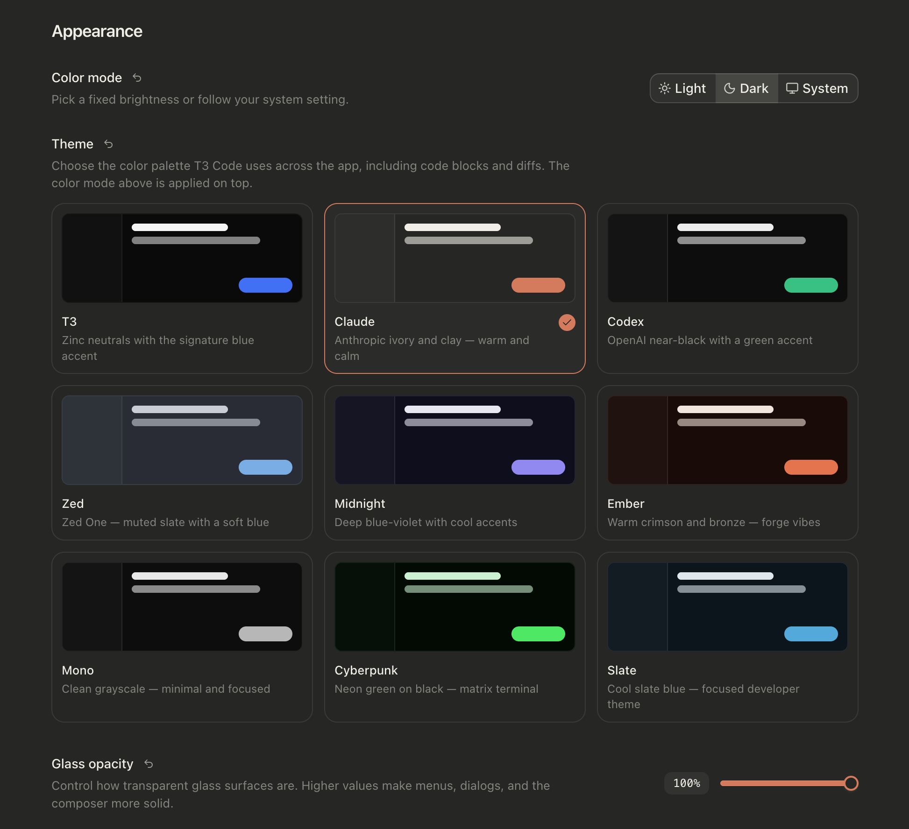

# T3 Code (Sandeep's fork)

This is a fork of [T3 Code](https://github.com/pingdotgg/t3code) that tracks upstream `main` and layers on a few extra features (below). Everything from upstream still applies — installation, providers, docs — plus the additions in [Fork features](#fork-features).

T3 Code is an "agent harness control surface". It enables control of the agents on your machine with a best-in-class mobile app ([iOS](https://apps.apple.com/us/app/t3-code-remote-claude-more/id6787819824), [Android](https://play.google.com/store/apps/details?id=com.t3tools.t3code)), [web app](https://app.t3.codes) and [Electron-based desktop app](https://t3.codes).

Works with your subscriptions on Claude Code, Codex, Cursor, Grok Build, and OpenCode. If they're set up on your computer, T3 Code can control them.

## "Wait, what are you selling me?"

Nothing. We built T3 Code because we wanted the best possible development experience with agents. We were inspired by existing solutions like the Codex desktop app, Conductor, Claude Desktop and Cursor Glass, but none met our bar.

We wanted something performant, remote-ready, and truly open. If we ever go the wrong direction, we want you to have everything you need to fork and build the editor that you want.

## Fork features

Additions on top of upstream T3 Code, in this repo only:

### Git panel with real staging and commit history

Git used to be scattered across three surfaces — the chat-header split button, the branch selector above the composer, and the Diff panel — with no view of commit history and no way to tell staged apart from unstaged changes.

There's now a dedicated Git tab in the right panel (`Cmd/Ctrl+Shift+G`). Per selected source folder it shows:

- Branch and upstream tracking status
- Working tree split into **Staged / Changes / Conflicts**, with per-file stage/unstage
- A commit box, plus Push or Publish
- Virtualized commit history with branch and tag pills

The panel reads and writes the real git index, so staging done here shows up in a terminal and vice versa — it's not a separate shadow state. The existing chat-header commit flow is unchanged and still commits everything the agent touched.

 

### Kanban board of every agent

The sidebar answers "what threads exist". It doesn't answer "which ones need me right now" — and once you're driving five or ten agents across several projects, that's the question that matters.

There's now a board at `/board` (`Cmd/Ctrl+Shift+B`, also in the sidebar and command palette) showing every thread across every project and environment as a card, grouped by what its agent is actually doing:

**Needs You · Working · Review · Done · Idle · Snoozed**



Columns are derived from live state, not set by hand, so a card moves the moment its thread does. A thread whose subagent fleet is still running after the turn settled shows under **Working**, not Idle. The grouping mirrors the sidebar's exactly, so the two never disagree.

Dragging is limited to the moves that map to a real command — drop on **Done** to settle, on **Snoozed** to snooze, drag back to return to active. The agent-owned columns don't accept drops, and a refused move says why instead of failing after the fact. Cards carry provider and model, branch or worktree, PR state, plan progress, and a link into the thread's Agents panel.

See [docs/user/board.md](./docs/user/board.md).

### Multiple source folders per project

A project used to be bound to exactly one directory. Now a project can reference several source folders — e.g. a design-system repo, a sibling service, and a docs folder — with one marked as primary. Every existing single-folder project keeps working identically; this is purely additive.

 

### Selectable color themes (Settings → Appearance)

Nine built-in color palettes on top of the existing light/dark mode, picked from a preview-card grid in **Settings → Appearance**:

- **T3** (default, unchanged)
- **Claude**, **Codex**, **Zed** — using each product's real brand colors
- **Midnight**, **Ember**, **Mono**, **Cyberpunk**, **Slate**

Each palette carries its own semantic tokens, nav-panel surfaces, and syntax highlighting theme for chat code blocks, diffs, and file previews.



## Installation

> [!WARNING]
> T3 Code currently supports Codex, Claude, Cursor, Grok Build and OpenCode. Install and authenticate at least one provider before use:
>
> - Codex: install [Codex CLI](https://developers.openai.com/codex/cli) and run `codex login`
> - Claude: install [Claude Code](https://claude.com/product/claude-code) and run `claude auth login`
> - Cursor: install [Cursor CLI](https://cursor.com/cli) and run `agent login`
> - Grok Build: install [Grok Build CLI](https://x.ai/cli) and run `grok login`
> - OpenCode: install [OpenCode](https://opencode.ai) and run `opencode auth login`

### Try it out (install-free)

The easiest way to test T3 Code is to run the server in your terminal (requires Node.js 22.16+, 23.11+, or 24.10+):

```bash
npx t3@latest
```

This will launch T3 Code's backend on your machine as well as the local web app to control your agents.

Tip: Use `npx t3@latest --help` for the full CLI reference.

### Desktop app

Install the latest version of the desktop app from [GitHub Releases](https://github.com/pingdotgg/t3code/releases), or from your favorite package registry:

#### Windows (`winget`)

```bash
winget install T3Tools.T3Code
```

#### macOS (Homebrew)

```bash
brew install --cask t3-code
```

#### Arch Linux (AUR)

```bash
yay -S t3code-bin
```

## Some notes

We are very very early in this project. Expect bugs.

We are (mostly) not accepting contributions yet. Small fixes may be considered. Big features will not be.

## Documentation

Full docs live in [docs/](./docs). There's no docs site yet.

- [Install and first run](./docs/user/install.md)
- [Board: every agent at a glance](./docs/user/board.md)
- [Permission modes](./docs/user/permission-modes.md)
- [Keyboard shortcuts](./docs/user/keybindings.md)
- [Customize a project icon](./docs/user/project-settings.md)
- [Remote access from a phone or another machine](./docs/user/remote-access.md)
- [Keeping app and server in sync](./docs/user/updating.md)
- [Source control integrations](./docs/user/source-control.md)
- Multiple accounts: [Codex](./docs/user/providers-codex.md) · [Claude](./docs/user/providers-claude.md)
- Linux: [run T3 Code as a background service](./docs/user/background-service.md)

Building from source? Start at [docs/internals/overview.md](./docs/internals/overview.md).

## If you REALLY want to contribute still.... read this first

### Install `vp`

T3 Code uses Vite+ so you'll need to install the global `vp` command-line tool.

#### macOS / Linux

```bash
curl -fsSL https://vite.plus | bash
```

#### Windows

```bash
irm https://vite.plus/ps1 | iex
```

Checkout their getting started guide for more information: https://viteplus.dev/guide/

### Install dependencies

```bash
vp i
```

Read [CONTRIBUTING.md](./CONTRIBUTING.md) before opening an issue or PR.

Need support? Join the [Discord](https://discord.gg/jn4EGJjrvv).
