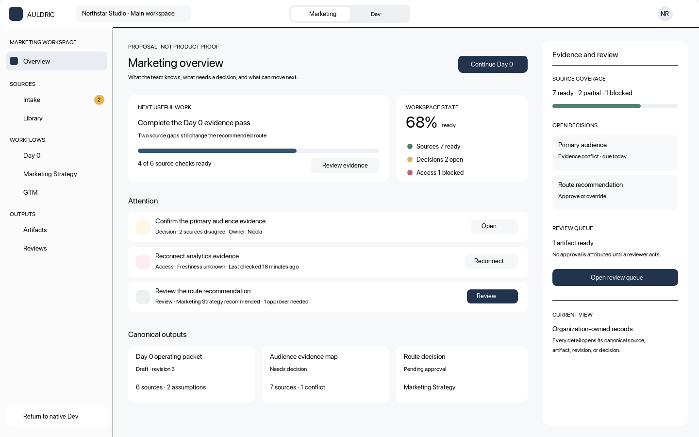
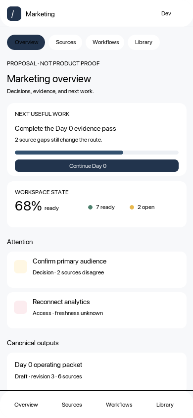

# Marketing shell design proposal

Issue #13 requires an approved desktop and narrow composition before issues #21 through #26 add
visual product code. This proposal is a design gate, not shipped-product proof.

## Design read

- **Surface:** an authenticated, repeated-use Marketing workspace on web and desktop, plus a
  deliberately supported narrow web layout. The public Auldric site remains issue #27.
- **Audience and job:** in-house Marketing, growth, and GTM teams need to bring in business context,
  see what is known or blocked, produce a Day 0 point of view, and choose one Marketing Strategy or
  GTM route without learning T3 runtime concepts.
- **Source evidence:** current authority and launch-readiness documents govern product truth. The
  issue #14 donor inventory permits a fresh rebuild of bounded Marketing requirements. Donor brand,
  copy, workflow, product-design documents, and screenshots are historical design evidence only.
- **Product model:** Sources and Library hold organization-owned knowledge and canonical outputs;
  workflows define Day 0, Marketing Strategy, and GTM; registered artifacts and reviews expose
  durable work; native T3 Dev remains a separate reversible domain.
- **Current mismatch:** the current route contains only an isolation placeholder. The donor UI
  evidence is sparse and useful for density and vocabulary, but it cannot prove current behavior or
  supply code. Native T3's shell is a coding surface and must not be reskinned into Marketing.

## Proposed direction

- Use a compact Auldric-owned shell with an explicit Marketing/Dev switch, organization/workspace
  selector, and bounded navigation for Overview, Sources, Library, Day 0, Marketing Strategy, GTM,
  Artifacts, and Reviews.
- Keep the main surface dense and operational. The first viewport shows next useful work, evidence
  and access status, open decisions, review state, and canonical outputs—not a marketing hero.
- Reuse current T3 control geometry, accessible primitives, focus treatment, system fonts, quiet
  borders, and responsive behavior. Apply the established Auldric navy identity only inside the
  Marketing composition; do not change Dev tokens or chrome.
- Use user-facing terms such as sources, evidence, decisions, outputs, review, and next work. Hide
  implementation terms such as RAG, MCP, database sync, provider internals, and raw artifact IDs.
- Use at most one memorable line in a view and immediately explain it in plain language. The product
  UI defaults to direct operational copy rather than slogan-led sections.
- Desktop may expose a collapsible evidence/review rail. Narrow layouts use one column, full-screen
  detail, scrollable section navigation, and no clipped desktop tables.

## Preview

Editable vector sources: [desktop](./marketing-shell-desktop-preview.svg) and
[narrow](./marketing-shell-narrow-preview.svg).

Both previews are deliberately populated enough to test information hierarchy. Their sample names,
counts, records, and percentages are illustrative and must not ship as seeded customer claims.

## State and accessibility contract

Issues #21 through #26 must design and test loading, empty, partial, blocked, denied, stale,
conflict, failed, retrying, recovered, revoked, and read-only states alongside the happy path.
Navigation uses semantic routes and landmarks; every status has text; keyboard focus returns to the
invoking control after overlays; narrow layouts cannot require horizontal page scrolling.

## Implementation boundary

The shell owns composition only. Backend definitions own workflows, stages, required artifact
slots, renderers, source floors, readiness, and review rules. Organization databases own canonical
records. Web-local catalogs and demo fixtures cannot become authority. Hosted-static access remains
no-data until a connected environment supplies a request-scoped verified T3 actor.

**Decision:** proposal ready for explicit navigation/layout approval; visual product implementation
remains gated.

**Next action:** receive approval or requested changes, then implement issue #21 against the repaired
issue #4 route boundary.

**Parked until:** issues #22 through #26 visual product code until this direction is approved and
their backend prerequisites are executable.
