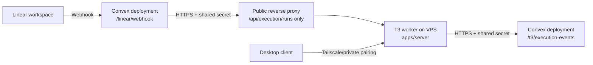

# Linear Agent MVP Remote Setup

This runbook is for the new `feature/orchestrator-agent` architecture, not the legacy fork-specific Linear runtime.

The goal is to wire Linear, Convex, and the remote T3 worker together so we can test the first user-visible MVP:

1. a Linear mention or delegation creates a control thread
2. the orchestrator starts one remote T3 worker run
3. the worker completes and reports status back
4. Linear gets one basic threaded reply

Important current status:

- Phase 2 is implemented: the Convex-to-T3 worker bridge exists and T3 can callback lifecycle events into Convex. See [packages/contracts/src/executionBridge.ts](../packages/contracts/src/executionBridge.ts), [apps/orchestrator/convex/executionRuns.ts](../apps/orchestrator/convex/executionRuns.ts), and [apps/server/src/executionBridge/http.ts](../apps/server/src/executionBridge/http.ts).
- The first install/test-ready Linear slice is implemented: raw signed Linear comment webhooks can create a control thread, start one worker run, and post one final threaded reply from Convex-owned run state.
- The app install path now has a real callback handler at `GET /linear/oauth/callback`, and the repo exposes a convenience install entrypoint at `GET /linear/oauth/install`.
- The current branch still uses one default repo mapping through `LINEAR_DEFAULT_WORKSPACE_ROOT`, and worker restart recovery is still a later phase. See [the plan](../.plans/convex-orchestrator-linear-refactor.md).

## What must be running

There are three runtime pieces in this architecture:

| Component           | Where it runs                     | What it does                                                                                  |
| ------------------- | --------------------------------- | --------------------------------------------------------------------------------------------- |
| `apps/server`       | EC2, DigitalOcean, or another VPS | Runs the T3 worker runtime, worktrees, provider sessions, and the authenticated worker bridge |
| `apps/orchestrator` | Deployed into Convex              | Owns control-thread state, execution-run state, and inbound/outbound orchestration logic      |
| Convex deployment   | Convex cloud                      | Hosts the public HTTP endpoints for Linear ingress and T3 lifecycle callbacks                 |

Important nuance: `apps/orchestrator` is source code plus a Convex deployment target. For the MVP, you do **not** run a second long-lived Node service on the VPS for it. The long-lived process on the VPS is still just T3.

## External services and accounts you need

- A Linear workspace with admin access
- A Convex account and deployment
- An EC2 instance, DigitalOcean Droplet, or another Linux VPS
- A DNS name and HTTPS reverse proxy for the public T3 bridge path
- A provider authenticated on the worker machine, such as Codex or Claude
- Optionally Tailscale for private desktop pairing to the worker

Useful repo references:

- Remote worker deployment: [docs/remote-deployment.md](./remote-deployment.md)
- Orchestrator deployment: [docs/orchestrator-deployment.md](./orchestrator-deployment.md)
- Headless remote pairing flow: [REMOTE.md](../REMOTE.md)
- T3 runtime host and port defaults: [apps/server/src/config.ts](../apps/server/src/config.ts)
- Headless `serve` command: [apps/server/src/cli.ts](../apps/server/src/cli.ts)

## Recommended network topology

The safest topology for this architecture is split-brain on purpose:

- keep the desktop pairing path private
- expose only the worker bridge path publicly
- let Convex stay public because it is the webhook receiver and callback target



Recommended rules:

- Do not expose raw port `3773` publicly if you can avoid it.
- Use Tailscale or another private path for pairing and desktop usage.
- Put Nginx or Caddy in front of the VPS and expose only `POST /api/execution/runs` to the internet.
- Keep the shared secret on both sides and use HTTPS everywhere public.

### MVP shortcut: one public hostname first

If the immediate goal is to get a remote browser UI working at `https://<your-subdomain.example.com>`, the fastest deployment path is to reuse that same public host for the worker bridge during the MVP.

That means:

- your chosen hostname reverse-proxies the full T3 server
- the browser UI loads from that host
- websocket RPC stays on the same host
- Convex calls `https://<your-subdomain.example.com>/api/execution/runs`

For this shortcut, prefer Caddy over Nginx:

- less HTTPS setup overhead
- cleaner websocket proxying
- a one-block config that is easy to reproduce in the playbook

Use this only as the fastest path to get the environment live. The more locked-down target shape is still:

- private operator access for the full T3 UI
- public exposure only for `POST /api/execution/runs`

If you take the shortcut, set:

```bash
T3_EXECUTION_BRIDGE_BASE_URL="https://<your-subdomain.example.com>"
```

and make sure the EC2 host has built both `apps/web` and `apps/server` so the browser UI can actually load from the remote box.

Why this shape fits the code today:

- Convex calls the worker at `T3_EXECUTION_BRIDGE_BASE_URL + /api/execution/runs` in [apps/orchestrator/src/t3/client.ts](../apps/orchestrator/src/t3/client.ts).
- T3 calls Convex back at `ORCHESTRATOR_BASE_URL + /t3/execution-events` in [apps/server/src/executionBridge/http.ts](../apps/server/src/executionBridge/http.ts).
- The remote desktop pairing path is still the normal T3 `serve` path described in [docs/remote-deployment.md](./remote-deployment.md) and [REMOTE.md](../REMOTE.md).

## Required environment variables and secrets

### On the Convex deployment

These are needed by the new orchestrator path:

| Variable                            | Required                  | Purpose                                                                      |
| ----------------------------------- | ------------------------- | ---------------------------------------------------------------------------- |
| `T3_EXECUTION_BRIDGE_BASE_URL`      | Yes                       | Public HTTPS base URL that Convex should call for `POST /api/execution/runs` |
| `T3_EXECUTION_BRIDGE_SHARED_SECRET` | Yes                       | Shared bearer secret used by both directions of the worker bridge            |
| `LINEAR_CLIENT_ID`                  | Yes for target agent path | OAuth app client id for the Linear agent                                     |
| `LINEAR_CLIENT_SECRET`              | Yes for target agent path | OAuth app client secret for the Linear agent                                 |
| `LINEAR_WEBHOOK_SECRET`             | Yes for target agent path | Linear webhook signing secret                                                |
| `LINEAR_BOT_USERNAME`               | Optional                  | Mention/display name used by the adapter                                     |
| `LINEAR_DEFAULT_WORKSPACE_ROOT`     | Yes for MVP trigger path  | Default repo path on the worker used when a Linear mention starts a run      |

Repo references:

- worker base URL + shared secret are read in [apps/orchestrator/src/t3/client.ts](../apps/orchestrator/src/t3/client.ts)
- the callback endpoint shares the same secret in [apps/orchestrator/convex/http.ts](../apps/orchestrator/convex/http.ts)
- the Chat SDK Linear adapter package expects the `LINEAR_*` variables listed above in [apps/orchestrator/node_modules/@chat-adapter/linear/README.md](../apps/orchestrator/node_modules/@chat-adapter/linear/README.md)

### On the T3 worker host

These are needed on EC2, DigitalOcean, or another VPS:

| Variable                            | Required             | Purpose                                                               |
| ----------------------------------- | -------------------- | --------------------------------------------------------------------- |
| `ORCHESTRATOR_BASE_URL`             | Yes                  | Public base URL of the Convex deployment used for lifecycle callbacks |
| `T3_EXECUTION_BRIDGE_SHARED_SECRET` | Yes                  | Shared bearer secret for authenticating bridge traffic                |
| `T3CODE_HOME`                       | Strongly recommended | Persistent base directory for T3 state on the host                    |
| `T3CODE_HOST` / `--host`            | Recommended          | Bind address for headless remote pairing                              |
| `T3CODE_PORT` / `--port`            | Optional             | T3 listener port, defaults to `3773`                                  |

Repo references:

- bridge auth: [apps/server/src/executionBridge/routeAuth.ts](../apps/server/src/executionBridge/routeAuth.ts)
- callback config: [apps/server/src/executionBridge/http.ts](../apps/server/src/executionBridge/http.ts)
- remote worker basics: [docs/remote-deployment.md](./remote-deployment.md)

Provider CLI requirement on the worker:

- install the provider CLIs on the worker host before expecting the browser UI to show them as available
- for the systemd-based EC2 path in this repo, the simplest install is:

```bash
sudo npm install -g @openai/codex @anthropic-ai/claude-code
```

- authenticate as the same Unix user that runs `t3code.service`

```bash
codex login --device-auth
claude auth login
```

- verify later with:

```bash
codex login status
claude auth status
```

- for a headless worker, `codex login --device-auth` is the easier flow because it prints a browser URL and one-time code you can complete locally while the SSH session stays open
- for Claude on Amazon Bedrock, configure Bedrock in Claude Code on the worker itself rather than expecting T3 to manage AWS auth directly
- preferred flow: run `claude`, choose `3rd-party platform`, then `Amazon Bedrock`, and finish the Claude Code wizard as the same Unix user that runs `t3code.service`
- if you need scripted setup instead of the wizard, configure Claude Code for Bedrock with `CLAUDE_CODE_USE_BEDROCK=1`, `AWS_REGION=<region>`, and normal AWS SDK credentials such as `AWS_PROFILE`, SSO, or access keys
- prefer Claude Code `modelOverrides` for Bedrock inference profile IDs or ARNs; use T3 `customModels` only when you intentionally want extra selectable model entries in the T3 picker

## Linear-side configuration

The new architecture should be configured as a **Linear agent/app**, not as the old fork-specific webhook runtime.

### 1. Create a Linear OAuth application

Use Linear’s OAuth app flow, not a personal API key, for the real MVP path.

Why:

- official Linear guidance recommends OAuth2 for integrations
- agent installs use `actor=app`
- the Chat SDK adapter supports `clientId` and `clientSecret`

Official references:

- Linear OAuth overview: [linear.app/developers/oauth-2-0-authentication](https://linear.app/developers/oauth-2-0-authentication)
- Linear OAuth actor authorization: [linear.app/developers/oauth-actor-authorization](https://linear.app/developers/oauth-actor-authorization)
- Linear Agents getting started: [linear.app/developers/agents](https://linear.app/developers/agents)

Recommended app settings:

- choose the final app name and icon carefully because that is how the agent appears in Linear
- enable webhooks
- enable **Agent session events**
- optionally enable **Inbox notifications** and **Permission changes**
- enable client credentials tokens if you want the adapter’s `clientId`/`clientSecret` auth path

### 2. Install the app into the workspace as an app actor

For an agent that can be mentioned or delegated, the install flow should use `actor=app`.

Recommended scopes for the MVP:

- `read`
- `comments:create`
- `app:mentionable`
- `app:assignable` only if you want issue delegation as a trigger in addition to mentions

Why these scopes:

- Linear’s agent docs say `actor=app` is the right mode for agents and service accounts
- `app:mentionable` makes the app appear in mention surfaces
- `app:assignable` makes it delegatable on issues

The official docs also note that `actor=app` installs cannot request `admin`.

### 3. Webhook categories to enable

For the current MVP path, enable:

- `Comments` data change events: required
- `Issues`: recommended
- `Emoji reactions`: optional
- `Agent session events`: optional for future operator visibility, but not required for the current comment-webhook runtime

Why this matters:

- the current branch starts runs from raw `Comment create` webhooks
- unsupported webhook resource types are safely ignored
- reactions and richer agent-session flows remain future-facing validation work

### 4. Webhook URL to register

Target URL:

- `https://<your-convex-site>/linear/webhook`

Current implementation:

- the route exists in [apps/orchestrator/convex/http.ts](../apps/orchestrator/convex/http.ts)
- it verifies the raw `Linear-Signature` header against the request body
- it normalizes raw `Comment create` payloads in [apps/orchestrator/src/linear/ingress.ts](../apps/orchestrator/src/linear/ingress.ts)
- it starts one worker run for a matching mention and ignores unsupported webhook resource types

## How the orchestrator and worker fit together

Today’s real cross-system contract is already in place:

1. Convex creates an `executionRunId` for a `controlThread`
2. Convex calls `POST /api/execution/runs` on the worker
3. T3 creates a project if needed, creates a fresh thread, and dispatches `thread.turn.start`
4. T3 watches real orchestration lifecycle updates and posts `started`, `completed`, or `failed` back to Convex
5. Convex applies those events idempotently by `eventId`

Relevant implementation files:

- bridge contract: [packages/contracts/src/executionBridge.ts](../packages/contracts/src/executionBridge.ts)
- Convex run state: [apps/orchestrator/convex/schema.ts](../apps/orchestrator/convex/schema.ts)
- Convex bridge logic: [apps/orchestrator/convex/executionRuns.ts](../apps/orchestrator/convex/executionRuns.ts)
- T3 bridge entrypoint: [apps/server/src/executionBridge/http.ts](../apps/server/src/executionBridge/http.ts)
- T3 run bootstrap: [apps/server/src/executionBridge/runStart.ts](../apps/server/src/executionBridge/runStart.ts)

## Step-by-step MVP setup

This is the operator path I would use on a fresh setup.

### 1. Deploy the remote T3 worker

Follow [docs/remote-deployment.md](./remote-deployment.md) for EC2, DigitalOcean, or another VPS.

At minimum:

- install Bun
- clone the repo
- `bun install`
- build `apps/web`
- build `apps/server`
- install provider CLIs on the worker machine
- authenticate your provider on the worker machine
- set `T3CODE_HOME`
- run the server under `systemd`

For this architecture, also set:

```bash
ORCHESTRATOR_BASE_URL="https://<your-convex-site>"
T3_EXECUTION_BRIDGE_SHARED_SECRET="<strong-random-secret>"
```

### 2. Put a public HTTPS proxy in front of the worker bridge

Expose only:

- `POST /api/execution/runs`

Do not make the full T3 server broadly public unless you intentionally want that risk.

Suggested shape:

- public `worker-bridge.example.com` -> reverse proxy -> local T3 server
- only the bridge path is routed externally
- keep desktop pairing on Tailscale or another private path

Fastest MVP variant:

- public `<your-subdomain.example.com>` -> Caddy -> local T3 server
- the same host serves the browser UI and the bridge route
- this is acceptable for a first bring-up if speed matters more than minimizing exposure

### 3. Deploy the Convex orchestrator

From `apps/orchestrator`:

```bash
bun run dev
# or deploy to your hosted Convex deployment
```

For a persistent remote MVP environment, use a real Convex deployment rather than relying on a local dev session.

Set these deployment env vars in Convex:

```bash
T3_EXECUTION_BRIDGE_BASE_URL="https://worker-bridge.example.com"
T3_EXECUTION_BRIDGE_SHARED_SECRET="<same-strong-random-secret>"
LINEAR_CLIENT_ID="<linear-oauth-client-id>"
LINEAR_CLIENT_SECRET="<linear-oauth-client-secret>"
LINEAR_WEBHOOK_SECRET="<linear-webhook-secret>"
LINEAR_BOT_USERNAME="<your-bot-name>"
LINEAR_DEFAULT_WORKSPACE_ROOT="/absolute/path/to/the-repo-on-the-worker"
```

If you are using the single-hostname MVP shortcut instead of a separate bridge hostname:

```bash
T3_EXECUTION_BRIDGE_BASE_URL="https://<your-subdomain.example.com>"
```

### 4. Create and install the Linear app

In Linear:

1. Create a new OAuth application.
2. Enable webhooks.
3. Enable client credentials tokens.
4. Set the callback URL to `https://<your-convex-site>/linear/oauth/callback`.
5. Install the app into the workspace with `actor=app`.
6. Request at least `read`, `write`, `comments:create`, and `app:mentionable`.
7. Add `app:assignable` if you want delegation to trigger runs too.

Also keep the webhook signing secret and client credentials in your secrets manager.

The simplest operator path after the env vars are in Convex is:

1. visit `https://<your-convex-site>/linear/oauth/install`
2. complete the Linear `actor=app` authorize flow
3. wait for the Convex callback page to confirm the code exchange succeeded

### 5. Register the webhook URL

Use:

- `https://<your-convex-site>/linear/webhook`

For the current branch, this path is live for:

- raw signed `Comment create` webhooks
- top-level issue comments and nested replies, both routed to stable root-comment thread ids
- one-run/one-final-reply behavior for the mention-trigger happy path

### 6. Confirm bidirectional bridge connectivity

Before involving Linear, verify the worker bridge itself:

- Convex can reach `https://worker-bridge.example.com/api/execution/runs`
- the worker can reach `https://<your-convex-site>/t3/execution-events`
- both sides use the same `T3_EXECUTION_BRIDGE_SHARED_SECRET`

This is the cleanest way to de-risk the deployment before Phase 3.

## Verification checklist

### Phase 2 verification that should work now

- [ ] The T3 worker is reachable on its private pairing path from the desktop client
- [ ] The public worker bridge URL accepts authenticated `POST /api/execution/runs`
- [ ] Convex has `executionRuns` and `executionRunEvents` tables deployed
- [ ] A test run moves through `requested` -> `accepted` -> `started` -> `completed` or `failed`
- [ ] T3 lifecycle callbacks arrive at `POST /t3/execution-events`
- [ ] Duplicate lifecycle callback delivery does not double-apply the event

### MVP verification for the current branch

- [ ] Mentioning the Linear app on an issue or comment creates exactly one Convex control thread
- [ ] The orchestrator starts exactly one T3 execution run
- [ ] T3 spins up a fresh thread and begins the turn
- [ ] Linear receives exactly one threaded reply for the completed run
- [ ] Retrying the same webhook does not create a duplicate thread or reply

## Known gaps and provisional assumptions

These are the places where the branch is still intentionally limited:

- `LINEAR_DEFAULT_WORKSPACE_ROOT` is still a one-repo MVP mapping, not a durable project/team resolver
- replies are lifecycle-based and minimal; they confirm completion/failure rather than posting rich run summaries
- attachment handling is still markdown-link-only, not first-class file ingestion
- the server-side run registry in [apps/server/src/executionBridge/runStart.ts](../apps/server/src/executionBridge/runStart.ts) is intentionally in-memory for now, so worker restarts can lose run correlation until the recovery phase lands

## Recommended next operator move

Before trying to test mentions in Linear, I would do the setup in this order:

1. deploy the VPS worker and verify headless pairing
2. deploy Convex and verify the worker bridge by hand
3. set `LINEAR_DEFAULT_WORKSPACE_ROOT` in Convex
4. create and install the Linear app
5. send one mention in a Linear comment thread and verify the end-to-end path

That sequencing keeps deployment work moving now without confusing infrastructure setup with the still-open product slice.
