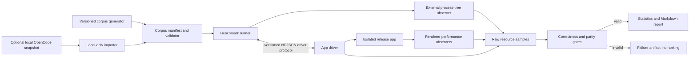

# feat: Add an honest agent-app performance benchmark

## Overview

Add a contributor-run benchmark framework that measures the core local-desktop workflows shared by AI coding-agent applications. The framework will be app-neutral at its corpus, scenario, driver, metric, and result boundaries while shipping T3 Code as the reference driver.

The first pull request will provide a deterministic public corpus, an optional privacy-preserving importer for local OpenCode sessions, six primary metrics, correctness/parity gates, whole-process resource sampling, a publication-grade statistics profile, and machine-readable plus Markdown reports. Its attached evidence bundle will include T3 Code and Claxedo results for every shared profile that both drivers pass. It will not claim a single overall winner or make performance CI-blocking.

## Problem Frame

AI coding-agent applications routinely claim to be fast using incomparable workloads, renderer-only memory readings, development builds, one-off timings, or datasets that another person cannot reproduce. One aggregate score rewards missing features and hides tradeoffs.

T3 Code already treats performance as a product invariant and has useful building blocks: a Rust process-tree resource monitor, typed provider event normalization, deterministic SQLite projection seeding, an Electron launcher, and Playwright Core. What is missing is a versioned benchmark contract that turns those pieces into reproducible and reviewable evidence.

## Planning Bootstrap and Assumptions

- The first pull request follows the recommended scope: framework, public corpus, T3 reference driver, and external-driver protocol. Third-party app drivers are not committed in this PR.
- The Claxedo comparison driver is a companion change in its own source repository, not part of the T3 commit. The T3 PR links its immutable source commit and discloses the application version, driver digest, corpus digest, coverage report, and raw samples.
- If the companion driver does not pass protocol, coverage, privacy, and lifecycle conformance, the affected profile is reported as invalid rather than omitted or replaced with hand-timed data.
- The framework is a manual contributor/release tool. CI runs its unit and contract tests but does not gate merges on wall-clock or resource thresholds.
- Version 1 benchmarks local desktop applications. Remote/tunnel latency, mobile clients, browser-only deployments, model inference, and repository build speed are separate future profiles.
- The benchmark may add narrowly scoped observability hooks, but it must not add benchmark-only fallback data paths or change normal runtime behavior.

## Requirements Trace

**Contracts and corpus**

- **R1 — App-neutral contract:** Define versioned corpus, capability, scenario, driver, sample, validity, and result contracts that another coding-agent app can implement without importing T3 TypeScript modules.
- **R2 — Reproducible corpus:** Ship a deterministic public corpus generator covering conversation, tools, Markdown, diffs, reasoning, attachments, lifecycle revisions, and ANSI terminal output without committing private transcripts or a large opaque database.
- **R3 — Real-data validation:** Provide an optional local OpenCode importer that snapshots a live SQLite database safely, selects the 20 largest sessions by final renderable `message + part` bytes, retains their selected event histories, and never emits transcript content into reports.

**Measurement and validity**

- **R4 — Six primary metrics:** Measure the six user-meaningful latency, responsiveness, memory, and idle-CPU metrics defined below. Additional observations remain diagnostics and cannot silently become scoring inputs.
- **R5 — Correctness before speed:** Mark a scenario invalid when content coverage, ordering, final state, navigation target, app stability, or measurement preconditions fail. Invalid results must never be ranked as faster.
- **R6 — Honest run rules:** Separate cold and warm states, use release builds and isolated app homes, publish raw samples and failures, disclose environment and app versions, avoid outlier deletion, randomize comparison order, and report distributions without a composite score.
- **R7 — Whole-app resources:** Measure the complete app-owned process family, including renderer, server, GPU, utility, and shipped monitoring processes. Exclude every disclosed harness-owned process—the runner, observer, and workload controllers—but never an unattributed app helper.
- **R8 — Capability profiles:** Compare applications only on profiles both declare and successfully validate. An app that omits reasoning cannot pass a reasoning-rich coverage profile.

**Reference implementations and evidence**

- **R9 — T3 reference path:** Run the T3 benchmark against an isolated production-style desktop build, seed final read models through the established projection-fixture pattern.
- **R10 — Reviewable artifacts:** Produce versioned JSON/NDJSON raw artifacts and a concise Markdown report containing workload digests, validity, distributions, resource topology, environment disclosure, and limitations.
- **R11 — Reproducible comparison evidence:** Attach T3 Code and Claxedo public-corpus results only for shared validated profiles, with immutable app/driver identities, paired raw samples, uncertainty, invalid counts, and no undisclosed automation.

## Scope Boundaries

- No single “performance score,” weighted ranking, or declaration of an overall winner.
- No network/model response-time measurements; measured scenarios use materialized local state without model or network activity.
- No destructive cache flushing or claims of a filesystem-cache-cold machine. “Cold app” means a new app process with a new isolated app profile.
- No benchmarks against the developer's live `~/.t3/userdata` or OpenCode database. Every run uses a copied/snapshotted fixture.
- No private transcript text, absolute workspace paths, credentials, attachment contents, or trace resource bodies in default reports.
- No performance thresholds in CI in version 1. CI verifies contracts, determinism, validation, statistics, and lifecycle cleanup only.
- No third-party application automation committed in the initial PR. Protocol portability is tested with a fake driver; the Claxedo comparison uses a separately versioned executable driver whose immutable source commit is linked from the result bundle.
- No reasoning-projection product fix bundled into the benchmark PR. Reasoning is recorded as an unsupported corpus shape, so unsupported applications are reported honestly rather than receiving synthesized events.

## Benchmark Profiles

Profiles prevent an application from being rewarded for not implementing a surface.

| Profile             | Required workload                                                        | Eligible applications                           |
| ------------------- | ------------------------------------------------------------------------ | ----------------------------------------------- |
| `workspace-core-v1` | Launch, open a work item, switch among 20 work items                     | Any local desktop coding-agent app              |
| `resource-core-v1`  | Process-family observation across every supported profile and quiescence | Any locally launched app with attributable PIDs |

An app may publish `N/A — unsupported capability`; it may not publish a timing for a profile whose coverage validation failed.

## Primary Metrics

Every metric has one semantic start and one user-visible or state-validated end. The runner records supporting diagnostics, but only these six values appear in the primary comparison table.

| ID  | Metric                                 | Definition and validity gate                                                                                                                                                                                                                                                                                                                                                                                                                                           |
| --- | -------------------------------------- | ---------------------------------------------------------------------------------------------------------------------------------------------------------------------------------------------------------------------------------------------------------------------------------------------------------------------------------------------------------------------------------------------------------------------------------------------------------------------- |
| M1  | `app.cold_ready_ms`                    | From a monotonic mark taken by the pre-started driver immediately before it invokes the app spawn primitive until the primary work surface is visible, stable for two animation frames, and accepts a trusted focus/input action. The driver records both endpoints on one monotonic clock and returns the raw evidence; runner-to-driver dispatch and driver startup are outside the metric. A crash, reload, blocking modal, or failed input invalidates the sample. |
| M2  | `work_item.cold_open_ms`               | From the trusted activation event observed in the renderer until a canonical non-empty message from the target session's latest corpus turn is visible, the composer is usable, the first fold contains no blank virtualization gap, and the same semantic/geometry state survives two consecutive animation frames. Titles, routes, skeletons, shimmers, and loading surfaces cannot satisfy the endpoint. The target corpus digest and item ID must match.           |
| M3  | `work_item.warm_switch_p95_ms`         | After an unmeasured public-UI pass opens all 20 work items, within-run p95 across a seeded, randomized sequence containing one real switch to each item, measured from the trusted renderer activation event to the same canonical latest-turn, complete-first-fold, two-frame-stable endpoint as M2. The first measured target differs from the final warm-up target. Full-window reloads remain valid but naturally cost more.                                       |
| M4  | `history.navigate_p95_ms`              | Within-run p95 for navigating between deterministic first/middle/last turn anchors, using one renderer timeline. The requested anchor must settle within the viewport tolerance without a later corrective jump.                                                                                                                                                                                                                                                       |
| M5  | `resource.peak_process_family_rss_mib` | Maximum **sampled** summed resident/working-set bytes of all app-owned processes during one measured profile run at the fixed active-resource cadence below. Comparisons use the same profile and scenario sequence; peaks from unequal supported-profile sweeps are never compared. PID identity includes start time to prevent PID-reuse errors.                                                                                                                     |
| M6  | `resource.quiescent_cpu_p95_pct`       | p95 summed process-family CPU over a 60-second observation window after 15 seconds of quiescence following the same measured profile, with no active turn, animation, diagnostics subscription, or benchmark action. One logical core equals 100%.                                                                                                                                                                                                                     |

Required diagnostics include retained RSS after the corpus sweep, per-scenario CPU time, I/O counters and semantics, process count/categories, idle wakeups where Electron exposes them, JavaScript heap, DOM node count, crash/reload count, failed samples, and corpus coverage. Diagnostics are never folded into an unpublished score.

## Publication Run Rules

### Profiles

- **Smoke:** one warm-up and three measured runs; verifies the harness and produces explicitly non-publishable estimates.
- **Quick:** one warm-up and five measured runs; useful for local iteration and labeled as an estimate.
- **Publication:** three warm-ups and twenty measured runs per app/profile. Comparison order is seeded and interleaved to reduce thermal and time-order bias.

### Environment

- Use a production/release build with the same architecture and comparable feature settings.
- Fix window dimensions, display scale, color scheme, font configuration, and reduced-motion setting.
- Record OS/build, CPU model and logical-core count, physical memory, architecture, display refresh rate, app version/commit, driver version, corpus and scenario digests, power source, thermal state, and relevant launch flags.
- Publication comparisons require the same machine, OS session, display, power state, corpus, framework version, and run profile. Results from different operating systems are never merged.
- Heavy tracing, screenshots, video, source capture, and DevTools UI remain disabled during primary measurements. Diagnostic traces run separately because tracing changes the workload and can contain sensitive source data.

### Statistics and failures

- Preserve every raw sample in execution order; do not delete statistical outliers.
- Report the median and a 95% bootstrap confidence interval across runs. Report within-run p95 only for scenarios that intentionally produce many equivalent interactions.
- Report failed and invalid run counts beside every result. A publication attempt containing an invalid measured run is not rankable. A rerun starts a new complete twenty-run attempt; the failed attempt remains in the artifact history and cannot be selectively replaced sample by sample.
- Report absolute values and percentage differences with confidence intervals. For same-machine interleaved comparisons, bootstrap the paired per-run differences and label a directional result only when that difference interval excludes zero and the effect exceeds the declared clock/observer resolution. Do not infer significance merely from whether two separately computed intervals overlap.
- Preserve exact, bounded, censored, unsupported, and invalid observations as distinct result states. In particular, do not coerce a censored observation to `0 ms`; compare bounded values only when their intervals support the claim.
- Store monotonic timestamps at the measurement boundary; wall-clock time is disclosure metadata only.

### Clock domains and observer provenance

- Never subtract timestamps produced by different processes or clock domains. Every duration records the clock owner, raw start/end evidence, resolution, and observer method.
- Driver lifecycle timings use one monotonic clock inside the already-running driver. Renderer interaction and navigation timings use one renderer `performance` timeline. Process resource metrics use the standalone observer's monotonic sample timeline.
- The runner validates evidence and aggregates durations; it does not reconstruct a duration from unrelated runner, driver, renderer, or operating-system timestamps.
- Protocol dispatch and serialization overhead inside a declared timing boundary remain part of that app driver's result. Driver conformance measures and reports no-op round-trip overhead so reviewers can reject a driver whose control plane materially affects results.

### Resource sampling

- Request 250 ms process-family samples during active profile scenarios and 1,000 ms samples during the quiescent CPU window. These are framework-versioned cadences; reports call M5 a sampled peak and never imply instantaneous maximum memory.
- Record requested and achieved cadence, sample timestamps, collection duration, and monitor errors. M5/M6 are invalid when fewer than 95% of expected samples arrive or any unexplained sample gap exceeds twice the requested interval.
- Characterize the standalone observer in an unmeasured control run and report its own CPU plus collection duration. Publication resource evidence requires observer p95 CPU at or below 1% of one logical core and p95 collection duration below 25% of the requested cadence. Do not subtract estimated overhead from application totals; if the observer exceeds either bound, resource metrics are invalid and the cadence must not be silently relaxed inside the same framework version.

## Context & Research

### Relevant code and patterns

- `native/resource-monitor/src/main.rs` already provides a persistent, direct process-tree sampler with PID/start-time identity, CPU, RSS, virtual memory, and I/O counters.
- `packages/contracts/src/resourceTelemetry.ts` defines the resource-monitor NDJSON protocol and platform capability disclosures. The benchmark should reuse this protocol rather than spawning `ps` repeatedly.
- `docs/internals/resource-telemetry.md` documents process ownership, sampling semantics, bounded history, Electron process metrics, and cross-platform limitations that the result format must preserve.
- `scripts/mobile-showcase-environment.ts` safely seeds deterministic projection data in a transaction after migrations. Its general projection-fixture responsibility should be extracted rather than copied into another raw-SQL seeder.
- `scripts/mobile-showcase.ts` and `scripts/dev-runner.ts` demonstrate the repository's Effect CLI, isolated environment, owned-child cleanup, structured error, and test patterns.
- `apps/desktop/scripts/electron-launcher.mjs` and `apps/desktop/scripts/smoke-test.mjs` provide the canonical desktop launch resolution and fatal-log handling patterns.
- `apps/desktop` already pins `playwright-core` 1.60.0. The benchmark runner should align with that version and use Playwright's Electron application/process/window APIs.
- `apps/server/src/provider/Layers/OpenCodeAdapter.ts` maps OpenCode SDK events into canonical `ProviderRuntimeEvent`s; - `apps/server/src/orchestration/Layers/ProviderRuntimeIngestion.ts` and `ProjectionPipeline.ts` are the production path from provider events to the read model rendered by web/desktop clients.
- `apps/web/src/components/chat/MessagesTimeline.tsx` and `ChatView.tsx` own the primary interaction endpoints. Existing timeline, thread-row, composer, and minimap test IDs can anchor the T3 driver.
- The companion Claxedo repository already has `packages/claxedo-app/perf-harness/` with Playwright flow automation, renderer clock-domain sampling, ABBA ordering, semantic readiness checks, and raw evidence. Its current route-intercepted web fixture deliberately bypasses the packaged desktop/server/filesystem path, so it is reusable driver/observer groundwork but not valid cross-app evidence by itself.
- Claxedo also has packaged-desktop probes in `packages/claxedo-desktop/scripts/startup-perf.ts`, `measure-idle-memory.ts`, and `performance-diagnostics-smoke.ts`. The companion driver should consolidate those real-app entrypoints behind the neutral protocol instead of creating a second Claxedo benchmark engine.

### Institutional learnings

The repository has no `docs/solutions/` corpus or `critical-patterns.md`. The controlling institutional guidance is `AGENTS.md`: never use live T3 state, snapshot SQLite with `VACUUM INTO`, never kill by name/pattern, keep provider normalization at adapter boundaries, use receipts rather than sleeps for server async work, and do not run repo-wide checks locally.

### Local corpus calibration

The planning scan of the 20 largest OpenCode sessions on this machine found 4,099 messages, 17,133 parts, 59,810 retained events, 58.36 MiB of final render state, 463.41 MiB of event history, and 521.78 MiB combined. These aggregate values calibrate scale and stress tiers only. They are regenerated from a safe snapshot during implementation, are not a claim of universal representativeness, and never authorize copying private content, identifiers, paths, or timestamps into the public corpus.

### External references

- The [Chrome DevTools Protocol Performance domain](https://chromedevtools.github.io/devtools-protocol/tot/Performance/) provides low-overhead runtime counters; the [Tracing domain](https://chromedevtools.github.io/devtools-protocol/tot/Tracing/) documents heavier diagnostic collection and its buffer behavior.
- Electron's [app metrics](https://www.electronjs.org/docs/latest/api/app) and [process metrics](https://www.electronjs.org/docs/latest/api/process) distinguish per-process CPU/memory and explain why macOS private memory is a useful diagnostic alongside cross-platform RSS/working set.
- Playwright's [Electron API](https://playwright.dev/docs/api/class-electron) supports launching an Electron app and obtaining its main process and first window, matching T3's pinned Playwright Core dependency.
- SPEC's [run and reporting philosophy](https://www.spec.org/cpu2000/docs/runrules.html) emphasizes disclosed configurations, reproducibility, multiple runs, and clearly labeling noncompliant estimates. This plan adopts those principles without claiming SPEC conformance.

## Key Technical Decisions

- **Use capability profiles, not one universal task:** Not every app exposes or validates every surface. Pairwise profile eligibility prevents missing work from looking like better performance.
- **Keep exactly six primary metrics:** A small scorecard keeps reports legible. Rich renderer, process, and trace data remain diagnostics so the framework can diagnose regressions without moving the comparison goalposts.
- **No composite score:** Weighting milliseconds, MiB, CPU, and throughput is a product preference disguised as mathematics. Reports show tradeoffs and statistically support individual claims.
- **Correctness is a gate, not metric seven:** Rendering half the transcript must produce `invalid`, not a faster number or a small penalty.
- **Make the public corpus generated and versioned:** A deterministic generator is reviewable, compact, and reproducible. Its manifest records semantic counts, byte counts, hashes, and generation seed.
- **Keep real sessions local-only:** The OpenCode importer proves ecological validity while preventing private text and credentials from entering git or standard result artifacts.
- **Rank local sessions by final render state:** UI work correlates with current message/part bytes, not append-only historical snapshot duplication. Event histories remain attached to the selected sessions for local diagnostics.
- **Use an external executable driver protocol:** NDJSON commands and typed JSON results let Electron, native, webview, and non-TypeScript apps participate without linking T3 packages. The T3 driver is a reference, not privileged runner logic.
- **Treat drivers as trusted local code:** The protocol uses child-process stdio, not a remotely exposed control API, but it does not sandbox an arbitrary executable. Publication runs use reviewed source pinned to an immutable commit/digest, a disposable working directory/profile, a sanitized public corpus, and no ambient benchmark secrets. Documentation must say that an unknown driver has the user's filesystem privileges and must not be run blindly.
- **Use production app paths:** Cold-state fixtures materialize the same final projection tables that production reads.
- **Observe process families externally:** The benchmark-owned native monitor watches the app root and declared external roots but is not a descendant included in totals. T3's shipped internal resource monitor remains included because it is app-owned product overhead.
- **Make ownership explicit:** Driver-declared roots are included only when they are shipped app processes required by the measured configuration. The benchmark runner, standalone observer, and workload controllers are harness processes and are excluded. Every report publishes the included and excluded process topology.
- **Prefer semantic readiness over sleeps:** Drivers return explicit target-visible, input-accepted, and quiescent signals. Timeouts bound failure; they do not define success.
- **Do not permit benchmark fast paths:** A driver may automate and observe a stock/release app, and a narrowly scoped app hook may expose evidence, but neither may skip production work, recognize corpus IDs to alter behavior, pre-render hidden results, or replace canonical producer events. Publish app, driver, and hook source digests so those claims can be audited.
- **Do not flush OS caches:** Cache flushing is privileged, destructive to unrelated workloads, and inconsistent across platforms. The framework names process/profile coldness precisely instead.
- **Separate measurement and diagnosis:** Primary runs use PerformanceObserver and process samples. CDP traces, screenshots, and videos are opt-in reruns attached to a failing scenario.

## Open Questions

### Resolved during planning

- **Should the T3 PR commit third-party drivers?** No. It includes an app-neutral process protocol, a fake external driver for contract tests, and T3 as the reference driver. The initial Claxedo comparison driver is versioned in its own repository and linked immutably from the evidence bundle.
- **Can private 20-session results be the canonical result?** No. They are secondary validation because reviewers cannot reproduce their content. The public generated corpus is canonical.
- **Should full OpenCode append-only history be sent to the renderer?** No. Cold UI load uses final materialized state.
- **Should performance regressions block CI?** Not in version 1. CI hardware variance would create noisy failures; CI verifies behavior and determinism.

### Deferred to implementation

- **Exact public-corpus scale constants:** Tune generated turn, tool, Markdown, and diff distributions against the aggregate manifest from the 20-session local corpus, without copying text or identifiers. Preserve the versioned generator once published.
- **External comparison-driver distribution:** The initial implementation proves portability with both the fake conformance driver and the separately versioned Claxedo companion driver. A registry, package format, signing policy, or in-repo catalog for additional third-party drivers belongs to later work.

## High-Level Technical Design

> _This illustrates the intended approach and is directional guidance for review, not implementation specification. The implementing agent should treat it as context, not code to reproduce._

### Driver lifecycle

1. Runner sends `hello`; driver returns protocol version, application identity, supported profiles, measurement methods, and required preparation.
2. Runner provides a corpus path/digest and isolated run directory; driver materializes only its own native state and returns a coverage manifest.
3. Runner rejects the run unless required semantic counts and hashes match the profile.
4. Driver launches the release app and returns owned root/external PIDs plus automation readiness.
5. Runner starts the external observer, then asks the driver to perform one named scenario.
6. Driver reports semantic milestones with raw endpoints from the metric's declared clock domain; the runner validates provenance and owns resource-observer samples without combining unrelated clocks.
7. Runner validates the end state, records raw samples, and asks the driver to shut down only PIDs it launched.
8. Statistics aggregate valid measured runs; diagnostic reruns are stored separately.

## Implementation Units

- [ ] **Unit 1: Version the benchmark, corpus, driver, and result contracts**

**Goal:** Establish the app-neutral vocabulary and immutable version-1 meanings before adding T3 automation.

**Requirements:** R1, R4, R5, R6, R8, R10

**Dependencies:** None

**Files:**

- Create: `benchmarks/agent-app/README.md`
- Create: `benchmarks/agent-app/corpora/core-v1.json`
- Create: `scripts/lib/agent-app-benchmark/contracts.ts`
- Create: `scripts/lib/agent-app-benchmark/contracts.test.ts`
- Modify: `scripts/package.json`

**Approach:**

- Define Effect Schema contracts for corpus entries, semantic hashes/counts, profiles, scenarios, driver messages, milestones, environment disclosure, raw samples, validity failures, statistics, and reports.
- Specify an executable NDJSON request/response protocol with correlation IDs, explicit protocol negotiation, bounded errors, and lifecycle ownership. Avoid a TypeScript-only plugin API.
- Encode the six primary metrics and their units as a closed versioned set. Diagnostics use a separate extensible namespace.
- Require drivers to disclose how they detect readiness and paint rather than trusting an unlabeled timestamp.

**Execution note:** Implement contract decoding and invalid-input tests before the runner consumes the schemas.

**Patterns to follow:**

- `packages/contracts/src/resourceTelemetry.ts` for versioned NDJSON schemas and capability disclosure.
- `scripts/dev-runner.ts` for Effect CLI errors and typed configuration.

**Test scenarios:**

- Happy path: decode a complete v1 corpus, driver handshake, valid sample, and result bundle and preserve all metric units.
- Edge case: accept an app that declares only a subset of the capability profiles without fabricating results.
- Error path: reject unknown protocol versions, duplicate correlation IDs, non-monotonic milestones, unknown primary metrics, negative durations/bytes, and missing validity evidence.
- Integration: a fake executable driver completes the full handshake and returns a capability-limited valid result through serialized NDJSON.

**Verification:**

- An independent process can implement the documented protocol using only JSON and the README.
- Every primary comparison value has one versioned definition, unit, and validity rule.

- [ ] **Unit 2: Generate and validate public and local corpora**

**Goal:** Produce reproducible public work and optional real-world local work without leaking user data.

**Requirements:** R2, R3, R5, R8

**Dependencies:** Unit 1

**Files:**

- Create: `scripts/lib/agent-app-benchmark/corpus.ts`
- Create: `scripts/lib/agent-app-benchmark/corpus.test.ts`
- Create: `scripts/lib/agent-app-benchmark/importers/opencode.ts`
- Create: `scripts/lib/agent-app-benchmark/importers/opencode.test.ts`
- Create: `scripts/lib/agent-app-benchmark/privacy.ts`
- Create: `scripts/lib/agent-app-benchmark/privacy.test.ts`
- Modify: `.gitignore`

**Approach:**

- Generate deterministic sessions from a committed seed/config, including text/Markdown/code/table/diff shapes, tool lifecycle revisions and payload sizes, optional reasoning/attachments, and deterministic ANSI terminal streams.
- Store content in generated local artifacts while committing only generator configuration, expected manifest, and digests.
- For local OpenCode data, use a read-only source connection and `VACUUM INTO` a temporary snapshot before querying. Rank sessions by final message/part bytes; select 20; retain only related session/message/part/event rows in the ephemeral corpus.
- Default reports contain aggregate counts, sizes, distributions, and hashes—not source IDs, titles, text, paths, URLs, tool arguments, or attachment contents.
- Build shareable reports from a closed, typed allowlist of aggregate fields. Run a privacy scanner over that allowlisted bundle as defense in depth; a scanner pass never makes raw local corpora, logs, traces, screenshots, or error payloads shareable.
- Create local-corpus run directories with owner-only permissions, keep source-derived artifacts out of stdout/stderr, and delete ephemeral snapshots on success by default. On failure, print only the private artifact location and cleanup status; sharing requires an explicit aggregate-export step.

**Execution note:** Start with fixtures containing deliberately planted credentials, home paths, URLs, and transcript phrases so redaction failures are observable.

**Patterns to follow:**

- The `AGENTS.md` SQLite snapshot procedure and one-way sandbox data rule.
- `scripts/mobile-showcase-environment.ts` for deterministic IDs/timestamps and transactional state.

**Test scenarios:**

- Happy path: the same seed generates byte-identical corpus artifacts and manifest digests across two runs.
- Happy path: an OpenCode fixture with more than 20 sessions selects exactly the top 20 by final message/part bytes and retains only their ordered event aggregates.
- Edge case: ties in session size resolve deterministically; missing optional tables and empty histories remain representable.
- Error path: malformed JSON, unsupported part/event versions, inconsistent foreign keys, or a failed SQLite snapshot abort without a partial shareable artifact.
- Privacy: seeded secrets, absolute paths, transcript snippets, auth rows, and attachment URLs are absent from default reports and logs.
- Integrity: message/turn/tool/reasoning/attachment counts and hashes change when content is dropped, reordered, or rewritten.

**Verification:**

- A clean checkout can regenerate the public corpus from its seed and match the committed manifest.
- Local import never mutates or launches against the source database and its default report is safe to inspect without transcript disclosure.

- [ ] **Unit 3: Extract reusable projection-fixture materialization**

**Goal:** Seed T3's final read model for cold-load scenarios through one reusable fixture writer instead of copying showcase SQL.

**Requirements:** R5, R9

**Dependencies:** Units 1–2

**Files:**

- Create: `scripts/lib/projection-fixture.ts`
- Create: `scripts/lib/projection-fixture.test.ts`
- Modify: `scripts/mobile-showcase-environment.ts`
- Modify: `scripts/mobile-showcase.test.ts`
- Create: `scripts/lib/agent-app-benchmark/drivers/t3-materializer.ts`
- Create: `scripts/lib/agent-app-benchmark/drivers/t3-materializer.test.ts`

**Approach:**

- Extract the schema-readiness check, transaction ownership, table clearing, and typed projection row writing used by the mobile showcase into a shared script-layer fixture writer.
- Keep corpus-to-T3 policy in the T3 materializer: map turns/messages/activities/attachments into T3's canonical projection shapes while retaining corpus IDs, order, timestamps, and semantic hashes.
- Seed only disposable benchmark homes after server migrations. Never point the application at a live or shared database.
- Validate materialized T3 rows back into a coverage manifest before timing begins.

**Patterns to follow:**

- `scripts/mobile-showcase-environment.ts` transactional `BEGIN IMMEDIATE` and busy-timeout behavior.
- `apps/server/src/persistence/Migrations/005_Projections.ts` and later migrations as the authoritative projection schema.

**Test scenarios:**

- Happy path: materialize a mixed conversation/tool/diff corpus and read back identical ordering, role, byte counts, and hashes.
- Regression: mobile showcase seeding produces the same projects, threads, turns, messages, and activities after extraction.
- Edge case: optional reasoning-rich entries are recorded in coverage without being synthesized into an unsupported T3 visible projection.
- Error path: missing migrations, schema drift, duplicate IDs, or an existing transaction rolls back completely and leaves no partial corpus.
- Isolation: fixture writing refuses the configured live T3 home and accepts only the runner-created disposable directory.

**Verification:**

- Showcase and benchmark seeding share one transaction/schema implementation.
- Cold-load timing begins only after a read-back coverage manifest passes.

- [ ] **Unit 4: Collect readiness evidence and process observations**

**Goal:** Measure user-visible endpoints and the complete app process family with disclosed, low-overhead observers.

**Requirements:** R4, R5, R7, R9

**Dependencies:** Units 1–3

**Files:**

- Create: `scripts/lib/agent-app-benchmark/process-metrics.ts`
- Create: `scripts/lib/agent-app-benchmark/process-metrics.test.ts`
- Create: `scripts/lib/agent-app-benchmark/drivers/t3.ts`
- Create: `scripts/lib/agent-app-benchmark/drivers/t3.test.ts`

**Approach:**

- Define readiness as semantic DOM/driver state plus two stable animation frames, not network-idle or an arbitrary timeout.
- Launch a second standalone resource monitor outside the app process tree, configured with the app root and Electron external roots. Include all descendants and the app's shipped internal monitor; exclude the benchmark-owned observer.
- Record raw per-process samples with identity and I/O semantics, then derive process-family aggregates without subtracting observer overhead from app totals.
- Classify each declared PID root as app-owned or harness-owned before launch. Include only app-owned roots in M5/M6 and fail validation when an observed app process cannot be attributed; never make an app look smaller by silently dropping an unattributed helper.

**Execution note:** Add observer-overhead characterization tests so resource sampling never exceeds its disclosed CPU/cadence bounds.

**Patterns to follow:**

- `native/resource-monitor/src/main.rs` and `apps/server/src/resourceTelemetry/NativeTelemetryClient.ts` protocol/timeout behavior.
- `apps/web/src/components/chat/MessagesTimeline.tsx` existing minimap test ID and animation-frame scheduling.

**Test scenarios:**

- Process tree: include descendants and declared Electron roots, distinguish PID reuse by start time, and exclude the external observer process.
- Ownership: exclude the workload controller while including T3's shipped server, renderer, GPU/utility, and internal-monitor processes; an unknown helper invalidates resource comparison until classified.
- Resource error: an unavailable or degraded native monitor invalidates M5/M6 while preserving valid driver metrics and clear failure evidence.

**Verification:**

- Each primary metric has raw evidence linking its semantic start and validated end.
- Process totals represent the disclosed app family and renderer probes do not require DevTools UI or heavy trace capture.

- [ ] **Unit 5: Orchestrate runs and produce statistically honest reports**

**Goal:** Turn corpus, driver, renderer, and process evidence into repeatable smoke/quick/publication runs and reviewable artifacts.

**Requirements:** R4, R5, R6, R7, R10

**Dependencies:** Units 1–4

**Files:**

- Create: `scripts/lib/agent-app-benchmark/statistics.ts`
- Create: `scripts/lib/agent-app-benchmark/statistics.test.ts`
- Create: `scripts/lib/agent-app-benchmark/report.ts`
- Create: `scripts/lib/agent-app-benchmark/report.test.ts`
- Create: `scripts/lib/agent-app-benchmark/runner.ts`
- Create: `scripts/lib/agent-app-benchmark/runner.test.ts`
- Create: `scripts/agent-app-benchmark.ts`
- Create: `scripts/agent-app-benchmark.test.ts`
- Modify: `package.json`
- Modify: `scripts/package.json`

**Approach:**

- Add an Effect CLI with explicit app-driver, corpus, profile, run-profile, seed, output, and diagnostic options. Defaults use the public corpus, T3 driver, and quick profile; publication output requires the full disclosure fields.
- Reserve isolated run directories and ports, track every child handle at spawn, and clean up only owned handles. Retain failed-run artifacts without retaining private content by default.
- Randomize and record scenario/app order from a seed. Separate warm-ups, measured samples, diagnostic reruns, and invalid samples.
- Implement median, percentile, paired bootstrap confidence intervals for interleaved comparisons, percentage difference, resolution checks, and non-ranking decisions over immutable raw samples. Separate intervals remain descriptive; the paired difference interval owns directional comparison claims.
- Write `run.json`, append-only `samples.ndjson`, `coverage.json`, `environment.json`, and `report.md`; include schema/framework versions and SHA-256 digests.

**Execution note:** Implement statistics and invalid-run aggregation test-first using fixed numerical fixtures before connecting the real driver.

**Patterns to follow:**

- `scripts/dev-runner.ts` for Effect CLI composition, port ownership, and structured process failures.
- `scripts/mobile-showcase.ts` for artifact planning, validation-only mode, and host automation cleanup.

**Test scenarios:**

- Happy path: fake-driver smoke and publication fixtures produce deterministic ordering, statistics, digests, and Markdown tables.
- Statistics: known odd/even samples yield documented medians; seeded bootstrap is reproducible; within-run p95 is never confused with cross-run p95.
- Honesty: no outlier deletion; a paired difference interval containing zero produces “no clear difference”; invalid/failed attempts prevent ranking and cannot be repaired by selective sample replacement; quick/smoke reports are labeled estimates.
- Edge case: partial driver output, timeout, signal interruption, full trace buffer, missing environment disclosure, or cleanup survivor produces a typed incomplete artifact.
- Privacy: report generation rejects shareable mode when its scanner detects transcript/path/token fixtures.
- Integration: runner launches the fake executable driver and standalone observer, completes a scenario, closes exact child handles, and leaves unrelated processes untouched.

**Verification:**

- One root command generates a self-contained report from a clean public corpus.
- A reviewer can recompute every table value from raw samples and determine why any result was invalid or not ranked.

- [ ] **Unit 6: Run reference/comparative benchmarks and document reporting rules**

**Goal:** Demonstrate the framework through its real entrypoint and provide a PR-ready T3 Code versus Claxedo results package for shared validated profiles.

**Requirements:** R6, R8, R9, R10, R11

**Dependencies:** Units 1–5 and a conforming Claxedo companion driver at an immutable source commit

**Files:**

- Create: `docs/internals/agent-app-performance-benchmark.md`
- Modify: `docs/README.md`
- Modify: `CONTRIBUTING.md`
- Modify: `benchmarks/agent-app/README.md`

**Companion repository work (versioned separately; not part of the T3 PR):**

- Add a thin executable protocol adapter under Claxedo's existing `packages/claxedo-app/perf-harness/`.
- Reuse its Playwright flows, semantic readiness, renderer sampling, and packaged-desktop scripts; do not copy T3 runner/statistics/report logic into Claxedo.
- Replace route-intercepted browser fixtures for publication runs with an isolated packaged-desktop configuration that consumes the public corpus through Claxedo/OpenCode's canonical persistence and event producers. Keep the existing renderer-proxy lane separately labeled for product-local regression testing.
- Add protocol, corpus-coverage, process-ownership, privacy, and cleanup conformance tests. The comparison bundle records the companion repository URL, immutable commit, dirty-state check, and executable digest.

**Approach:**

- Document metric semantics, profiles, public/local corpora, run profiles, environment controls, driver protocol, privacy rules, interpreting confidence intervals, and forbidden claims.
- Run T3's smoke and publication profiles through the public corpus on a release build. Attach generated `report.md`, coverage, environment, and raw samples to the PR rather than committing machine-specific results as permanent truth.
- Run the Claxedo companion driver on the same machine/OS session with seeded interleaving, the same public corpus and shared profile definitions, a stock release-equivalent build, and an isolated app home. Attach its raw samples and conformance/coverage evidence beside T3's.
- Produce comparisons only for profiles both applications support and validate. Show each metric independently with absolute values, paired differences, uncertainty, invalid counts, and measurement-method disclosures; do not collapse the result into “T3 wins” or “Claxedo wins.”
- Run the local 20-session corpus as secondary validation. Label it non-reproducible, disclose only aggregate workload statistics, and never upload raw local corpus or sensitive traces.
- Record each stock app version/configuration and immutable driver source. Modified forks receive separate labels and tables.

**Patterns to follow:**

- `docs/internals/resource-telemetry.md` for platform semantics and limitation disclosure.
- `AGENTS.md` PR requirements: conventional single-concern PR, latest-main rebase, and video for timing/motion claims when relevant.

**Test scenarios:**

- Documentation example: every example report passes the same schema and privacy validation as a real report.
- Reproducibility: a second public-corpus generation matches the documented corpus digest and semantic manifest.
- Acceptance: the T3 publication run completes all supported core profiles with zero invalid samples or explicitly identifies a product/capability failure instead of suppressing it.
- Cross-app acceptance: the Claxedo driver passes the same protocol/privacy/lifecycle tests, and only shared coverage-valid profiles enter paired comparison tables.
- Comparison: a deliberately incomplete fake app fails coverage and is omitted from ranking while its failure remains visible.

**Verification:**

- A contributor can reproduce the public T3 result from the documentation without accessing private data.
- A reviewer can reproduce the public comparison from the T3 framework plus the linked Claxedo driver commit; no undisclosed local automation is required.
- The PR can make only metric-specific, evidence-backed claims and includes raw artifacts needed to audit them.

## System-Wide Impact

- **Interaction graph:** Contributor CLI → corpus/materializer → T3 projection seeding → Electron/Web UI → Playwright driver → external resource monitor → validity/statistics/report.
- **Error propagation:** Driver, corpus, UI, process-monitor, cleanup, and privacy failures become typed invalid/incomplete result records. They do not fall back to synthetic success or disappear from reports.
- **State lifecycle risks:** Every run owns a fresh temporary T3 home, copied corpus, ports, child handles, and artifacts. Successful cleanup removes ephemeral state unless retention is requested; failed cleanup reports exact surviving identities.
- **API surface parity:** The external driver protocol is language-neutral. T3 web/mobile are not measured in version 1; no public WebSocket contract changes are required. Provider events continue to normalize through their production adapter.
- **Performance observer effect:** Primary observers are intentionally low-overhead and disclosed. Heavy traces are separate diagnostic reruns.
- **Data integrity:** Fixture transactions either fully materialize and validate or roll back. Live user databases remain read-only and are never used as application homes.
- **Security/privacy:** Local corpus and traces may contain source, prompts, tool arguments, and credentials. Default shareable artifacts are constructed from a typed aggregate-field allowlist, scanned as defense in depth, and stored in a gitignored owner-readable directory. Executable drivers are trusted local code pinned for publication; the stdio protocol is not a sandbox.
- **Unchanged invariants:** Normal T3 launch, provider selection, event sourcing, projection semantics, terminal behavior, resource diagnostics, and user settings remain unchanged outside explicitly launched benchmark runs.

## Risks and Mitigations

| Risk                                                 | Likelihood | Impact | Mitigation                                                                                                                                                                                                           |
| ---------------------------------------------------- | ---------: | -----: | -------------------------------------------------------------------------------------------------------------------------------------------------------------------------------------------------------------------- |
| Benchmark rewards omitted rendering                  |       High |   High | Capability profiles plus byte/hash/count coverage gates; invalid runs are unranked.                                                                                                                                  |
| Private corpus leaks into git or PR artifacts        |     Medium |   High | Local-only owner-readable directory, typed aggregate-field allowlist, defense-in-depth privacy scanner, explicit export, and no raw logs/traces/screenshots in shareable bundles.                                    |
| Instrumentation changes the measured workload        |     Medium |   High | Separate primary/diagnostic modes, characterize observer cost, and disclose framework/hook versions.                                                                                                                 |
| Cross-app endpoint definitions drift                 |     Medium |   High | Versioned semantic milestones, driver method disclosure, corpus digests, and protocol conformance tests.                                                                                                             |
| OS/background noise overwhelms small differences     |       High | Medium | Same-machine comparisons, interleaved seeded order, twenty runs, raw samples, paired-difference confidence intervals, thermal/power disclosure, and no directional claim when the difference interval includes zero. |
| Resource totals omit helper/provider processes       |     Medium |   High | Process-tree traversal plus explicit Electron roots and PID/start-time identity; publish process topology.                                                                                                           |
| Internal T3 monitor double-counts observer overhead  |        Low | Medium | External benchmark monitor is outside the app tree; shipped internal monitor remains correctly counted as product overhead.                                                                                          |
| Large corpus makes the PR or checkout heavy          |     Medium | Medium | Commit generator config/manifests, not generated database/content blobs.                                                                                                                                             |
| Maintainers view cross-app benchmarking as marketing |     Medium | Medium | Only the T3 reference driver is committed here; the Claxedo driver is independently linked, and reports use no composite score, a neutral protocol, reproducible data, and prominent limitations/invalid results.    |

## Phased Delivery

### Phase 1 — Contract and deterministic data

- Units 1–3 establish versioned contracts, public/local corpus handling, privacy, and final-state materialization.
- Exit criterion: fake-driver contract test and deterministic T3 coverage manifest work without UI timing.

### Phase 2 — Production-path workloads and observation

- Units 4–5 add the T3 driver, semantic milestones, readiness evidence, and whole-process telemetry.
- Exit criterion: one T3 scenario produces raw valid evidence without arbitrary success sleeps.

### Phase 3 — Statistics, reports, and comparative evidence

- Units 5–6 add orchestration, publication rules, reports, documentation, and shared-profile T3 Code/Claxedo statistics.
- Exit criterion: public results are reproducible and local 20-session results are safely labeled secondary evidence.

## Success Criteria

- A clean checkout can generate the public corpus and reproduce its manifest digest.
- The CLI can run a smoke benchmark with the fake driver, a release T3 benchmark with the reference driver, and a shared-profile comparison using the linked Claxedo companion driver.
- All primary metrics have raw evidence, units, validity status, and disclosed measurement methods.
- The T3 result includes the whole app process family and never reports renderer heap as total memory.
- Dropped/reordered content, navigation instability, reload/crash, unsupported rich content, or degraded monitoring makes the affected result invalid and visible.
- Publication reports contain twenty measured runs, raw samples, failures, median/CI statistics, environment disclosure, and no composite score.
- The optional importer selects the 20 largest final-state OpenCode sessions from a safe snapshot while standard reports reveal no transcript content.
- CI verifies deterministic contracts/statistics/cleanup without imposing machine-dependent performance thresholds.
- The PR description attaches reproducible T3 Code and Claxedo public-corpus stats for shared validated profiles, the immutable source commit for each driver, and separately labeled non-reproducible local-corpus validation.

## Documentation and Operational Notes

- Add generated benchmark data, snapshots, raw samples, reports, traces, and screenshots under one gitignored `artifacts/agent-app-benchmark/` root.
- Treat traces and local corpora as sensitive even when reports are shareable.
- Document how to stop or recover an interrupted run using owned PID records; never recommend killing by pattern.
- Publication artifacts should include a short limitations section naming unsupported profiles and observer/platform semantics.
- Do not commit a permanently “current” machine baseline. Attach signed/digested result bundles to releases or PRs so the code and environment remain attributable.

## Sources and References

- Repository guidance: `AGENTS.md`
- Resource telemetry: `docs/internals/resource-telemetry.md`
- Projection fixture precedent: `scripts/mobile-showcase-environment.ts`
- Desktop launcher: `apps/desktop/scripts/electron-launcher.mjs`
- Timeline UI: `apps/web/src/components/chat/MessagesTimeline.tsx`
- [Chrome DevTools Protocol Performance domain](https://chromedevtools.github.io/devtools-protocol/tot/Performance/)
- [Chrome DevTools Protocol Tracing domain](https://chromedevtools.github.io/devtools-protocol/tot/Tracing/)
- [Electron app metrics](https://www.electronjs.org/docs/latest/api/app)
- [Electron process metrics](https://www.electronjs.org/docs/latest/api/process)
- [Playwright Electron API](https://playwright.dev/docs/api/class-electron)
- [SPEC CPU run and reporting rules](https://www.spec.org/cpu2000/docs/runrules.html)
