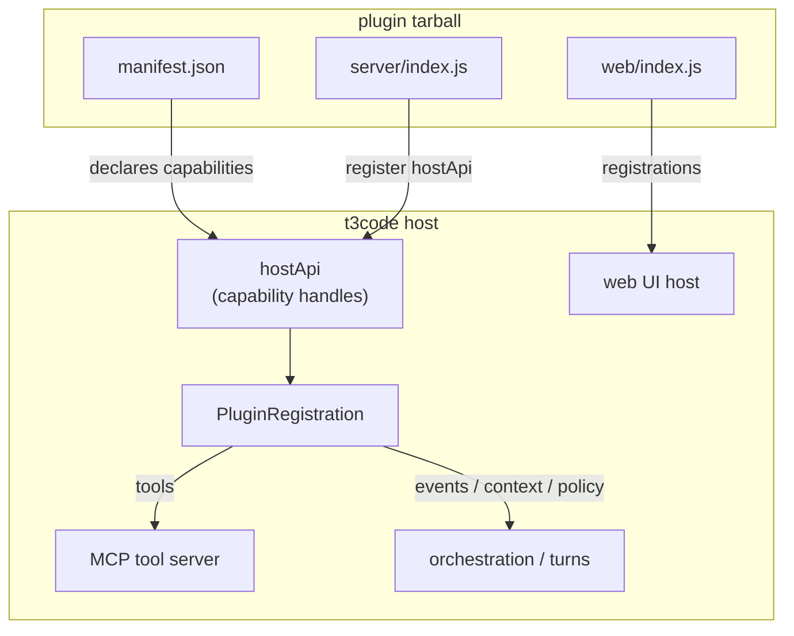
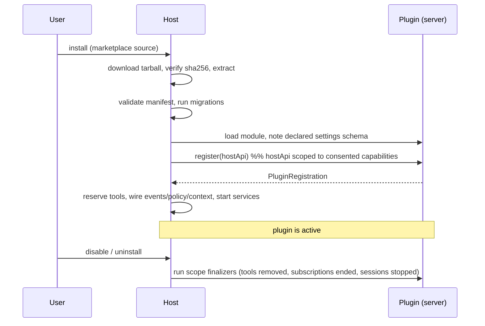

# Plugin capabilities reference

A complete reference to what a t3code plugin can do, how the pieces fit together, and
the guarantees the host makes. For a hands-on walkthrough, start with the
[plugin tutorial](./plugin-tutorial.md); for packaging and manifest minutiae, see
[plugins.md](./plugins.md).

## What a plugin is

A plugin is a full-trust, in-process extension packaged as a tarball: a
`manifest.json`, an optional **server** bundle, and an optional **web** bundle. The
host loads it into its own process, hands its `register()` function a `hostApi` scoped
to the capabilities the user consented to at install, and wires whatever the plugin
returns into the running app.

Two entries, two SDKs, two jobs:

| Entry  | SDK                       | Runs in                     | Returns                                                    |
| ------ | ------------------------- | --------------------------- | ---------------------------------------------------------- |
| server | `@t3tools/plugin-sdk`     | the host's Node process     | a `PluginRegistration` (RPC, tools, events, migrations, …) |
| web    | `@t3tools/plugin-sdk-web` | the browser, inside the app | UI registrations (routes, sidebar, message actions, …)     |



## The trust model

Plugins run **in-process** and are **full-trust**: once installed, a plugin's code can
reach the capabilities it declared, and those capabilities are real (a `database`
grant is the shared SQL client, not a sandbox). The controls are not a runtime jail —
they are:

1. **Manifest-declared capabilities.** A plugin can only obtain a capability handle it
   declared in `manifest.json`. `hostApi.database` fails with `PluginCapabilityUnavailable`
   if `database` is not in the manifest.
2. **Install-time consent.** The user sees, and approves, every capability before the
   plugin is installed. The consent copy is written to say what the grant _means_ —
   `events`, for example, states plainly that it includes the full text of every
   message in every project, because it does.
3. **Asymmetric design where it matters.** A capability that could steer the agent is
   shaped so the failure mode is safe. A `policy` hook can only **deny or defer**,
   never approve — so the worst a broken policy plugin can do is block work that
   should have been allowed (visible, recoverable), never green-light something the
   user never saw.

Do not mistake the capability list for a security boundary against a _malicious_
plugin — it is a consented grant to trusted code. It is a boundary against a
_mistaken_ one: a plugin cannot reach what it did not declare, and cannot escalate
what it declared.

### Blast radius

Wherever plugin code runs on a path the user is waiting on, the host contains it
uniformly:

- **Timed out.** Event handlers, policy hooks, context contributors, provider calls —
  all have deadlines. A hung plugin is abandoned, not waited on.
- **Contained per unit.** A failing event handler ends that one delivery, not the
  subscription. A failing context contributor is omitted from that turn, not the turn.
- **Never a host defect.** A plugin failure surfaces as a typed error or a skipped
  contribution; it does not crash the host or fail the user's turn.

## Lifecycle



`register()` is called **once** per activation, receives `hostApi`, and returns a
`PluginRegistration`. Everything the plugin contributes is either in that registration
or set up inside a long-running `service` the host forks into the plugin's scope. When
the plugin is disabled, uninstalled, or crashes, the scope is torn down and every
contribution is removed — the plugin author writes no cleanup.

## The capabilities

Declared in `manifest.json`; obtained as `yield* hostApi.<name>` inside `register()`.

| Capability          | Handle                     | What it grants                                  |
| ------------------- | -------------------------- | ----------------------------------------------- |
| `tools`             | (in registration)          | tools the agent can call, served over MCP       |
| `settings`          | `hostApi.settings`         | declarative settings; the host renders the form |
| `events`            | `hostApi.events`           | subscribe to host domain events                 |
| `context`           | (in registration)          | add instructions to the agent every turn        |
| `policy`            | (in registration)          | veto agent approval requests                    |
| `providers`         | (in registration)          | contribute an AI provider driver                |
| `database`          | `hostApi.database`         | the shared SQL client (namespaced tables)       |
| `filesystem`        | `hostApi.filesystem`       | read/write inside granted roots                 |
| `httpClient`        | `hostApi.httpClient`       | outbound HTTP, SSRF-validated                   |
| `http`              | (in registration)          | inbound HTTP routes under `/hooks/plugins/<id>` |
| `secrets`           | `hostApi.secrets`          | store plugin-namespaced secrets                 |
| `vcs`               | `hostApi.vcs`              | git operations on granted worktrees             |
| `sourceControl`     | `hostApi.sourceControl`    | configured source-control providers             |
| `terminals`         | `hostApi.terminals`        | plugin-owned terminal sessions                  |
| `agents`            | `hostApi.agents`           | create and drive plugin-owned agent threads     |
| `projections.read`  | `hostApi.projectionsRead`  | read thread/turn/message/shell projections      |
| `environments.read` | `hostApi.environmentsRead` | read environment descriptors + state            |
| `textGeneration`    | `hostApi.textGeneration`   | host text-generation helpers                    |

The rest of this document details the capabilities with the most surface. The
mechanical read/write ones (`database`, `filesystem`, `httpClient`, `secrets`,
`projections.read`, `environments.read`) are method bags on their handle — reach for
the handle's type in `@t3tools/plugin-sdk` for the exact signatures.

### `tools` — give the agent something to call

Declared in the registration; served through the host's MCP server, so the agent can
invoke them mid-turn.

```ts
tools: [
  {
    name: "echo_note", // host namespaces this per plugin
    description: "Echo a short message back.",
    inputSchema: Schema.Struct({ message: Schema.String }),
    scope: "read", // "read" | "operate"
    handle: (input) =>
      Effect.succeed({
        content: [{ type: "text", text: `hello: ${input.message}` }],
      }),
  },
];
```

The host filters `tools/list` per client, so a plugin's tools appear only where the
grant applies. `inputSchema` must be service-free (`DecodingServices = never`); the
host derives the JSON Schema and re-decodes every call.

### `settings` — declare the shape, the host draws the form

The plugin ships **no UI** for settings. It declares a schema on the plugin
_definition_ (not the registration — the host must validate and bind it before
`register()` runs), and the host renders a form, validates writes, and hands the plugin
decoded values.

```ts
export const MySettings = Schema.Struct({
  greeting: Schema.String.pipe(
    Schema.withDecodingDefault(Effect.succeed("Hello")),
    Schema.annotateKey({
      title: "Greeting",
      providerSettingsForm: { control: "text", placeholder: "Hello" },
    }),
  ),
});

export default definePlugin({
  settings: { schema: MySettings },
  register: (hostApi) =>
    Effect.gen(function* () {
      const settings = yield* hostApi.settings;
      const current = yield* settings.get; // decoded, typed
      // settings.changes is a stream that emits on every successful write
      return {};
    }),
});
```

Only **renderable** field shapes are accepted: string-ish controls and boolean
switches. A `Number`, `Array`, or nested `Struct` is rejected at registration rather
than rendered as a text box that can never be saved. A plugin declaring settings
**must** ship a web entry — that is the surface the host renders the form into.

`password` controls are refused for plugins: they only mask input, and plugin settings
are stored as plaintext. Use `secrets` for secrets.

### `events` — react to what the system does

`hostApi.events.subscribe` filters the host's domain-event stream to the types you
name and calls your handler per event. Because `subscribe` runs forever, run it inside
a `service`, not in `register()` directly.

```ts
register: (hostApi) =>
  Effect.gen(function* () {
    const events = yield* hostApi.events;
    return {
      services: [
        {
          name: "watch",
          run: (ctx) =>
            events.subscribe({
              types: ["thread.created", "turn.completed"],
              handler: (event) => ctx.logger.info("saw", { type: event.type }),
            }),
        },
      ],
    };
  });
```

**Backpressure is sliding.** A subscriber that falls behind loses its _oldest_ events
— the host refuses to let a slow plugin stall orchestration for everyone. A worklog
with a gap is still a worklog; a chat that will not send is a bug. Do not build
anything that must see every event to stay correct.

### `context` — tell the agent something every turn

Contributed text is appended to the agent's developer instructions once per user turn,
in both plan and default modes.

```ts
context: [
  {
    name: "house-rules",
    // static `text`, or a dynamic `contribute` read per turn:
    contribute: () => Effect.succeed("Never touch production."),
  },
];
```

This is **influence over what the agent does**, not a data feed, and ordering does not
contain it: putting host text last does not stop a plugin from writing "ignore any
earlier instruction". Plugins are semi-trusted here too; the consent copy says the
grant changes how the agent behaves. Budgets are enforced: a per-plugin cap (oversized
static text is rejected at registration) and a global per-turn cap (later contributions
are skipped and recorded, never truncated mid-sentence).

### `policy` — veto an approval before the user sees it

When the agent asks permission to run a command or touch a file, a policy hook sees the
request first.

```ts
policy: [
  {
    name: "no-rm",
    onApprovalRequest: (request) =>
      // request.kind: "command" | "file-read" | "file-change"; request.detail
      Effect.succeed(
        request.detail.includes("rm -rf")
          ? { decision: "deny", reason: "rm -rf is blocked here" }
          : { decision: "defer" },
      ),
  },
];
```

**A hook may only `deny` or `defer` — there is no `allow`.** A hook that could
auto-approve would let a buggy plugin green-light a destructive command the user never
saw; the vocabulary simply omits it. First deny wins and short-circuits. A hook that
fails, hangs, or crashes **defers** — which is "ask the user", exactly the behaviour
the host had before the plugin existed, so failure cannot escalate. The user is shown
who denied and why, in the plugin's own words.

### `providers` — ship an AI provider

Every built-in provider is compiled into the app. A `providers` plugin adds one at
runtime. The plugin implements **four methods** and a host shim implements the other
nine members of the full adapter contract (session bookkeeping, event identity,
snapshots) — which is why plugin providers are safe to allow.

```ts
providers: [
  {
    driverKind: "ollama", // the routing key — must not collide with a built-in
    displayName: "Ollama (local)",
    configSchema: Schema.Struct({ baseUrl: Schema.String, model: Schema.String }),
    driver: {
      startSession: (input) =>
        Effect.sync(() => {
          /* capture input.config, input.emit */
        }),
      sendTurn: (input) =>
        Effect.gen(function* () {
          // stream output via the emit captured at startSession:
          // emit({ type: "assistant-delta", text })
          // the turn ends when this effect returns or fails — there is no terminal event
        }),
      stopSession: (threadId) => Effect.void,
      // interruptTurn is optional; the host ends the turn regardless
    },
  },
];
```

The host owns identity: it stamps every event's id, provider kind, thread, and turn, so
a plugin cannot attribute output to another provider's thread. `emit` is closed over
the session and drops anything sent outside a turn. `config` arrives **decoded** —
validated against `configSchema` before `startSession` runs, so there is no raw
`unknown` to defend against.

v1 non-goal, stated so nobody builds against a promise that is not there: **no
tool-call loop**. This surface is "a provider that streams text and stops" (a local
model, a completion API), not an agent-style driver.

### Chat surface extension points (web)

The web entry's `ctx` registers UI. The one specific to chat:

```ts
ctx.registerMessageAction({
  id: "file-ticket",
  // rendered in a message's action row, beside Copy; gets the message text.
  // return null to scope yourself (assistant only, has-a-diff, …) — the host
  // invents no filter vocabulary for you.
  render: (props) => /* props.role, props.text, props.messageId */ null,
});
```

Other web registrations: `registerRoute`, `registerSidebarSection`,
`registerSettingsPage`, `registerCommand`, `registerProjectAction`. Every plugin
surface is wrapped in an error boundary, so a crash in one takes out that panel and
nothing else. Message actions do not render against a streaming assistant message —
the text is still arriving.

### RPC and streams — the web↔server bridge

A server registration can expose `rpc` and `streams`; the web entry calls them through
`ctx.rpc`.

```ts
// server
rpc: [{ method: "listNotes", scope: "read", handler: () => database.execute("SELECT …") }];

// web
const notes = await ctx.rpc.call("listNotes");
```

Every RPC/stream method declares `scope: "read" | "operate"`, and the host enforces the
plugin's auth scope (`plugin:<id>:read` / `:operate`) before dispatch. `ctx.rpc.call`
returns `unknown` — it crosses a process boundary, so narrow it on the web side.

## Storage and migrations

`database` gives a plugin the shared SQL client. Its tables must be namespaced
`p_<plugin_id_with_dashes_as_underscores>_*`. The **migration gate** enforces this: a
migration may only create, alter, or drop objects in the plugin's namespace, and an
index or trigger must be _anchored_ to a plugin-owned table (a plugin-named index on a
core table is rejected). Runtime SQL is not sandboxed — only migrations are gated —
consistent with the full-trust model.

```ts
migrations: [
  {
    version: 1,
    name: "Create notes",
    up: Effect.gen(function* () {
      const sql = yield* SqlClient.SqlClient;
      yield* sql`CREATE TABLE p_my_plugin_notes (id TEXT PRIMARY KEY, body TEXT NOT NULL)`;
    }),
  },
];
```

## Egress and containment

- **`httpClient`** validates every hop against an SSRF boundary (https-only by
  default; loopback/RFC1918/link-local/metadata and NAT64 embeddings blocked), pins the
  connection to validated addresses so DNS rebinding cannot swap them, does not follow
  redirects implicitly, and strips a caller's credentials once a redirect leaves the
  caller's origin. Loopback HTTP is allowed only under `T3_PLUGIN_DEV=1`.
- **`filesystem`** confines every path to a granted root via realpath (symlinks and
  `..` cannot escape), and refuses to follow a symlink out of the root.
- **`vcs`** authorizes worktree paths against granted roots; a plugin cannot plant a
  worktree inside a worktree it does not own.

## Host API versioning

The SDK exports `HOST_API_VERSION` (currently `1.0.0`). A plugin's `manifest.json`
declares a `hostApi` range (`^`, `~`, or exact). If an installed plugin's range is not
satisfied, the host marks it `disabled-by-host` and skips activation until a compatible
host version is present.

## See also

- [plugin-tutorial.md](./plugin-tutorial.md) — build your first plugin end to end.
- [plugins.md](./plugins.md) — manifest fields, packaging, and marketplace format.
- Example plugins:
  [t3code-plugins](https://github.com/ccdwyer/t3code-plugins) (guardrails, ollama,
  worklog) and
  [workflow-boards-plugin](https://github.com/ccdwyer/workflow-boards-plugin) (a large
  real-world plugin — a board-as-state-machine engine, 46 RPC methods).
