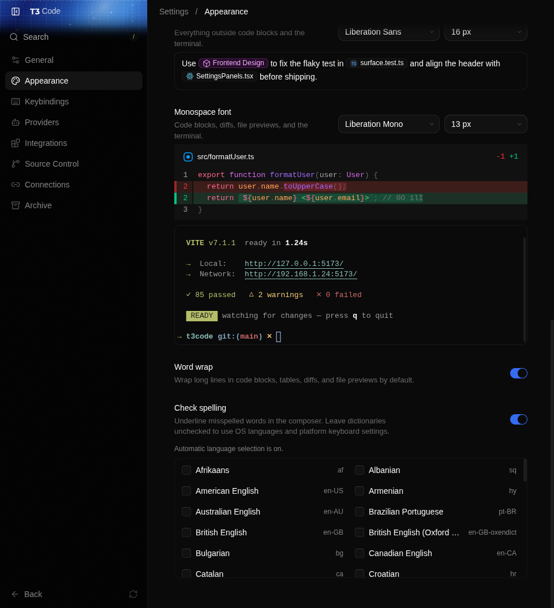

# Message composer

Messages can contain up to 120,000 characters. If a draft is longer, T3 Code keeps it in the
composer and shows how many characters need to be removed. Shorten the draft or split it into
multiple messages, then send again in the same thread.

The desktop app underlines misspelled words using the operating system's preferred languages.
Automatic selection prioritizes the active Windows input method, includes other installed Windows
input methods, and, on Linux, reads XKB environment settings, `/etc/vconsole.conf`, and
`/etc/default/keyboard`. This means an English locale with a Brazilian keyboard can check both
English and Portuguese. If no supported dictionary matches, T3 Code disables checking instead of
silently falling back to English. Turn checking off or select any dictionary supported by the
current desktop build in Settings → Appearance → Check spelling. macOS uses its native automatic
language detection.

