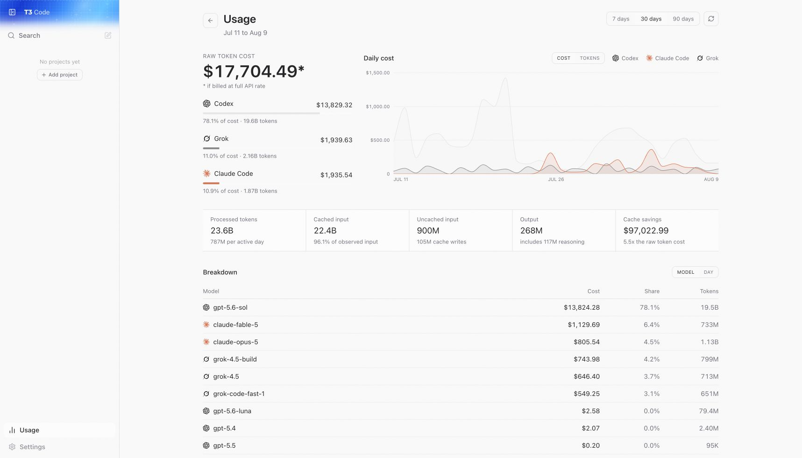

# Usage reports

Usage reports summarize local Claude Code, Codex, and Grok Build activity. Open **Usage** from the desktop sidebar or from **Settings → Usage** on mobile.

_Example report with randomized simulated Grok data._

Choose a 7, 30, or 90 day window to see API-rate-equivalent cost, processed tokens, providers, models, and recent days. Subscription plans bill separately, so the cost shown is not necessarily an amount charged to your account.

Each connected environment reads its provider transcripts locally and sends only aggregated daily totals to the client. If several environments point at the same transcript directory, T3 Code counts that directory once.

Some providers include an exact cost in their transcripts. For records without one, T3 Code estimates cost from known model rates; unknown models remain visible in token totals and are marked unpriced.
